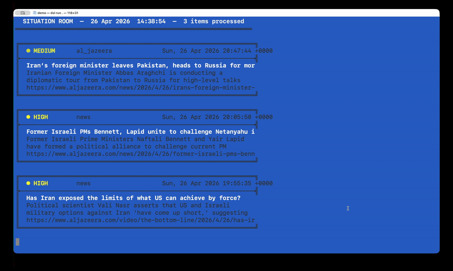
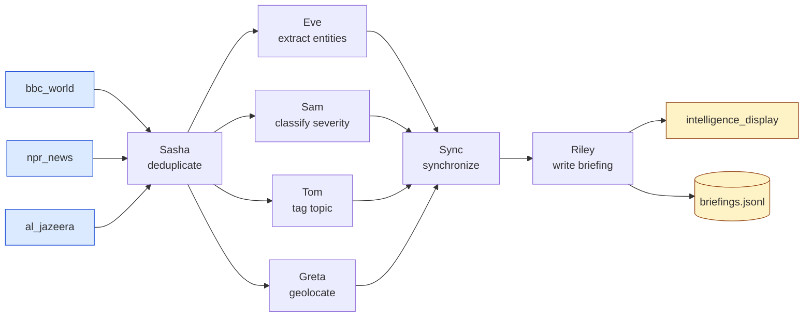

# DisSysLab — the aspirational README

> **This is not the README. It is the README of the version that does
> not exist yet.**
>
> It is written in the present tense throughout, as though everything
> described is finished, because that is the only way to tell whether
> the finished thing would be worth having. Some of it is true today.
> Some of it is a design with nothing behind it.
>
> **[What in this document is not true today](#what-in-this-document-is-not-true-today)**
> at the foot of the page lists every claim, marks it built or not
> built, and points at the design. Read that section before quoting
> anything here.
>
> The real README is [README.md](README.md).

---

**Tell an AI assistant what to watch and what to do about it. It
builds you a network of agents that runs continuously — and the hard
parts underneath, the message passing and the termination detection
and the recovery, come from a tested library instead of being
improvised for your application.**

Three people are using it for three different things. Start with what
they got.

---

## 1. A first-year builds a system by talking, one sentence at a time

She has written Python for six weeks and has never heard of a race
condition. She opens Claude Cowork and says:

> *Give me an office with Dan and Jay.*

She has not said what they do, and she is not asked. The assistant
writes a file:

```
# Office: draft

Agents:
Dan is unassigned.
Jay is unassigned.
```

> Two agents, no roles yet. **Still to do:** Dan and Jay have no role;
> no source; no sink; nothing is connected.

That is the whole protocol, and it is visible from the first sentence:
**what you said, written down** — and **what is missing, as a list**.
Nothing was invented on her behalf. There is no source she did not ask
for, no sink, no helpful guess about what Dan might be. An office this
incomplete cannot run, and the assistant says so rather than filling
the hole.

> *Dan reads what comes in and sends the urgent ones to `immediate`
> and everything else to `delay`.*

```
Dan is a router.
```

`roles/router.md`, written from her sentence and close to verbatim:

```
# Role: router

Decide whether each message is urgent.

If the message is urgent, send to immediate.
Otherwise, send to delay.
```

> Dan routes to `immediate` and `delay`. **Still to do:** Jay has no
> role; no source; no sink; Dan's `immediate` and `delay` go nowhere.

Her sentence declared Dan's two outboxes. The names came out of her
own words — no model was asked to guess them — so the checker already
knows Dan has two unwired outputs, and says so before a single
connection exists.

> *Jay evaluates the sentiment of what it receives.*

```
Jay is a sentiment_classifier.
```

> Jay is a `sentiment_classifier` from the role library — it adds a
> `sentiment` field with values positive, negative or neutral.
> **Still to do:** no source; no sink; Dan's `immediate` and `delay`
> go nowhere; Jay's output goes nowhere.

She has been handed a component she has never seen, so she is told
what it emits. Otherwise she wires the next agent to it blind and
meets the mismatch at run time.

> *The urgent ones go to Jay. Read Hacker News, and print whatever Jay
> produces.*

```
# Office: urgent_sentiment

Sources: hacker_news(max_articles=10)
Sinks: console_printer, discard

Agents:
Dan is a router.
Jay is a sentiment_classifier.

Connections:
hacker_news's destination is Dan.
Dan's immediate is Jay.
Dan's delay is discard.
Jay's out is console_printer.
```

> No gaps. The office runs.

<p align="center">
  
</p>

Four sentences. At no point was there a blank page, a form to fill in,
or a wall of questions — and at no point did she have to hold the
half-built thing in her head, because it was on the screen the whole
time. The office was renamed when it acquired a purpose. The gap list
was never an error message; it was the remaining work, which is the
same list either way and reads completely differently.

And what she now owns is a real concurrent system. Dan and Jay are
separate threads that share no memory and communicate only by
messages. If the feed goes quiet the office does not spin. When the
work is genuinely finished, the office detects that — with no agent
able to see the whole system — and exits. She wrote none of that, and
she can read all of it.

---

## 2. A tester finds out whether it is the strategy he meant

He thinks about markets, not about Python. He has a trading rule in
his head and a backtest saying the rule made money. The question he
cannot answer from a column of signals is whether the code implements
the rule he was thinking of.

> *Show me the working for the Donchian 20 strategy on NVDA.*

He gets a spreadsheet: one row per trading day, and every quantity the
strategy computed on the way to its decision — not just the signal but
the upper and lower channel — and a sentence at the end of each row
saying which rule fired. *"close 121.8 > upper 119.4 — go long."*

Each computed quantity appears twice. Once as the number the Python
produced, and once as a live Excel formula over the price cells, with
a column comparing the two. Click a shaded cell and the formula bar
reads `=MAX(C2:C21)`. That says the channel is built from the twenty
rows *above* this one and not this one — a boundary convention that is
ambiguous in English, invisible in a chart, and decides whether the
backtest was honest. If it is not his rule, he edits the cell and
watches the signal column move.

And before any strategy is traded on, three mechanical checks run
against it — checks written by someone who never saw that strategy:

- **Contract.** One finite signal per bar.
- **Determinism.** Same bars, same parameters, same answer.
- **Look-ahead.** The strategy is recomputed on truncated history, and
  it fails if any earlier decision moves once later bars are added.

The last one catches the classic trap: a strategy that peeks at
tomorrow's close is brilliant on history and loses money live. Nothing
about an AI assistant makes it immune to writing one. The harness is
what catches it.

See [dissyslab/gallery/apps/mac_speed_suite/](dissyslab/gallery/apps/mac_speed_suite/)
and [dissyslab/gallery/apps/paper_trader/](dissyslab/gallery/apps/paper_trader/).

---

## 3. A chemist triages a screen overnight

Her screening robot drops a file of assay results into a folder every
few hours. She says:

> *Watch the runs folder. Anything that beats 100 nanomolar, check it
> isn't a known frequent hitter, find me what's published on the
> scaffold, and put it in tomorrow's list.*

```
Sources: assay_folder(path="runs/", poll_interval=300)
Sinks: markdown_digest(path="triage.md"), jsonl_recorder(path="rejected.jsonl")

Agents:
Nina is a potency_filter(threshold_nM=100).
Omar is a structure_canonicaliser.
Pia is a pains_screen.
Quinn is a literature_scout.
Rafi is a writer.
```

Nina and Pia are exact and run as Python. Quinn reads papers and runs
on a language model. They are agents in the same office, and only one
of them costs anything to run.

But the components are not the interesting part. These are:

- **Two SMILES strings can name the same molecule.** Anything that
  compares, deduplicates, or splits a set of compounds canonicalises
  first, and a split that puts the same compound on both sides is
  refused rather than reported.
- **A random train/test split leaks.** Close analogues land on both
  sides, the model scores beautifully, and it fails on chemistry it
  has not seen. Splits are by scaffold, and the report states the
  nearest-neighbour similarity across the split so the number is not
  taken on trust.
- **IC50 in nanomolar and Ki in micromolar are neither the same number
  nor the same quantity.** Values with different endpoints or units
  are not silently merged; a conversion has to be asked for, and it is
  recorded.

Nobody who wrote the message-passing layer knows what a PAINS filter
is, or would have thought to check that a scaffold split was used. A
chemist knew. That is the whole mechanism this project is betting on.

---

## The bet

Look-ahead bias is not a concurrency bug. It is a *finance* bug, and
only someone who knows finance knows to check for it. Scaffold leakage
is not a concurrency bug either.

So: the concurrency layer is domain-independent, and above it sit
domain libraries. Each contributes two things — that field's
components, and that field's characteristic errors, written as checks
that run against code the check's author never saw. The expert
inherits working concurrency. Everyone else inherits the expert's
suspicion.

Two domains exist: trading and drug discovery. Two is the beginning of
evidence that the pattern transfers, and not the end of it. The
question this project is really asking is whether the third domain
costs less than the second did.

---

## Start here

You need Claude Cowork — the Claude desktop app — and Python 3.10 or
newer. Nothing else.

**1. Run Cowork on your computer.** When you start a task in Cowork
you can run it *on your computer* or *in the cloud*. Choose **on your
computer**.

**2. Install the library.** Tell Cowork:

> *Install the Python package `dissyslab` for me, then run `dsl list`
> and show me what offices come with it.*

You should see forty offices — 31 applications and 9 smaller examples.
If anything looks wrong: *run `dsl doctor` and tell me what it says.*

**3. Run one that already exists.** Tell Cowork:

> *Make me my own copy of the `periodic_brief` office in a folder
> called `my_brief`, then run it and open the result.*

Ten to twenty seconds later you have an HTML page built from live news
headlines and current weather. No key, no account, no model download.

<p align="center">
  
</p>

**4. Give the assistant the skill.** Steps 2 and 3 ran something that
already existed. To have the assistant *build* offices, it needs the
skill that teaches it to assemble them from library components.
Without the skill it improvises its own concurrency constructs, which
is the thing this project exists to avoid.

> *Install the `office-builder` skill from
> github.com/kmchandy/DisSysLab and follow it when you build offices
> for me.*

Check that it took:

> *Which version of the office-builder skill do you have?*

The answer should be a dated string such as `2026-08-19.385377d`.
Anything vaguer means the assistant did not get the skill; tell it to
load the skill again, and to say so if that fails and why.

**5. Ask for something you actually want.** Each of these corresponds
to an office that ships with the library, so the assistant has a
worked example to start from:

> *Watch the BBC and NPR news feeds and give me one page each morning
> with the headlines and the weather.* — no language model needed
>
> *Watch three tech-news feeds and tell me when a competitor is
> mentioned.* — needs a language model, free local or hosted
>
> *Rate my unread email by urgency and draft replies to the routine
> ones.* — needs your email account
>
> *Listen to my garden recordings and tell me which birds are there.*
> — needs a folder of recordings and a bird-call model

[course/SETUP.md](course/SETUP.md) is this same path at more length,
with what to do when a step misbehaves. **Students** begin at
[course/START_HERE.md](course/START_HERE.md). **Contributors** begin
at [CONTRIBUTING.md](CONTRIBUTING.md).

---

## Forty offices to start from

| | |
|---|---|
| **Watching the world** | news briefings, an arXiv radar, a competitor watch, a weather monitor |
| **Your own day** | a morning page, inbox triage, a wardrobe assistant |
| **Money and markets** | a ticker read in plain English, a backtester, a paper trader |
| **The bench** | assay triage, hit-list review, scaffold search |
| **Work and operations** | job matching, ticket routing, lead qualification, shipment release |
| **The physical world** | bird calls from recordings, animals in camera-trap photos, room climate, a loudness alarm |
| **Learning and argument** | an adaptive tutor, a structured debate |

`dsl list` shows them once the library is installed, and
[course/START_HERE.md](course/START_HERE.md) describes each one. Tell
the assistant to start from the nearest one and change it.

Some offices use language models; others are pure Python and free to
run. Where an agent uses a model you choose which, and agents in the
same office can use different ones — `Eve's AI is ollama.` alongside
`Riley's AI is claude.` — so an application need not be uniformly
expensive. Supported backends are `anthropic`, `openai`, `gemini`,
`openrouter` and `ollama`. See
[docs/LANGUAGE_MODELS.md](docs/LANGUAGE_MODELS.md).

---

## What the assistant writes, and how to read it

An **office** is a network of agents, each with one job. Sources fetch
from the world, agents transform the stream, sinks act on the result.
An office runs continuously. Each agent is a thread with its own
inboxes and outboxes; agents share no memory.

The office below reads three news feeds, removes duplicates, extracts
four kinds of information in parallel, waits for all four, and writes
a briefing.



The diagram is generated from the office's `office.md`, which is the
whole program:

```
Sources: bbc_world(max_articles=3), npr_news(max_articles=3), al_jazeera(max_articles=3)
Sinks: intelligence_display, jsonl_recorder_briefing(path="briefings.jsonl")

Agents:
Sasha is a deduplicator(by="url").
Eve is an entity_extractor.
Sam is a severity_classifier.
Tom is a topic_tagger.
Greta is a geolocator.
Sync is a synchronizer(inboxes=["entities", "severity", "topic", "location"]).
Riley is a writer.

Connections:
bbc_world's destination is Sasha.
npr_news's destination is Sasha.
al_jazeera's destination is Sasha.
Sasha's out is Eve, Sam, Tom, Greta.
Eve's out is Sync's entities.
Sam's out is Sync's severity.
Tom's out is Sync's topic.
Greta's out is Sync's location.
Sync's out is Riley.
Riley's out is intelligence_display, jsonl_recorder_briefing.
```

**You do not write this file. You read it.** The assistant writes it,
and it is the record of what was built — reading it is how you check
that what the assistant understood is what you meant. It is also what
you revise: you say what should change, and the assistant changes the
file.

Each agent's job is either an English description in `roles/<name>.md`
run by a language model, or Python in `roles/<name>.py`, which is
deterministic and costs nothing. English suits jobs that need
judgment; Python suits jobs that are exact. An office is itself a
black box with inboxes and outboxes, so an office may contain offices.

---

## Why the grammar is deliberately small

```bash
dsl check my_office
```

`dsl check` reports an office's structural faults before it runs: an
inbox nothing writes to, an agent nothing can reach, work that reaches
no sink, a sink nothing feeds, a role with no file behind it, a source
or sink name in no registry (with the nearest real name suggested), a
feedback loop with no gate. On an office still being built it reports
the same findings as the gap list of §1, because they are the same
findings.

This is why `office.md` has a narrow grammar. The language is small
and rigid not so that a person can write it, but so that `dsl check`
can catch what a language model got wrong before anything runs. A more
expressive language would be pleasanter to write by hand and would
defeat its own purpose: the narrower the grammar, the more of a
generated office can be checked mechanically.

The check is structural, and it stops where structure stops. An office
whose diagram is correct can still deadlock, because whether a message
is ever readable can depend on execution history rather than on the
graph. That boundary is not a gap to apologise for — it is one of the
subjects the course teaches.

---

## Then study the algorithms underneath

That is the second half of the point. A student builds something they
care about, and then finds out what was holding it up.

- **Termination detection.** How does an office know that no agent
  will ever send another message, when no agent can see the whole
  system? It does this every time it exits cleanly.
- **Global snapshots.** The Chandy–Lamport distributed snapshot is
  implemented;
  [dissyslab/gallery/apps/recovery_demo/](dissyslab/gallery/apps/recovery_demo/)
  interrupts an office mid-run and resumes it.
- **Causal order.** `dsl run --trace` records what every agent did,
  and `dsl explain-trace` merges the per-agent logs into one sequence
  ordered by logical timestamp. Reading it is how you see that
  "before" in a distributed system is not the same as "earlier on the
  clock".

The formal treatment behind the course is *Parallel Program Design: A
Foundation*, K. Mani Chandy and Jayadev Misra (Addison-Wesley, 1988).
Algorithm notes are in [docs/algorithms/](docs/algorithms/).

---

## What it costs

The library is free and so is running it. Offices that use only Python
cost nothing at all. Where an agent needs a language model you have
two choices, and the assistant will set up either: a model on your own
machine through Ollama, free and accountless but wanting a reasonably
recent laptop; or a hosted model, which needs an account and runs a
few cents a day for a typical morning brief.

**Every office in this repository stops after a few cycles by
default**, so that nobody meets this project by way of a bill. Most
are designed to run indefinitely and you can say so.
[docs/LANGUAGE_MODELS.md](docs/LANGUAGE_MODELS.md) has the details.

---

## What it does not do

Stated plainly, so that nobody infers a promise the software does not
keep.

- **Single machine.** An office runs in one process, each agent in a
  thread. Per-agent process parallelism does not work. The intended
  unit is a whole office, which is designed and not built
  ([docs/internals/design/process_per_office_design.md](docs/internals/design/process_per_office_design.md)).
  Distribution across machines is roadmap.
- **Checkpoint-recovery is opt-in.** An office has it where the author
  of a stateful agent has written `save_state` and `load_state`.
- **Deadlock detection does not exist.** `dsl check` finds structural
  faults only.
- **Domain checks are not proofs.** They catch the mistakes a field
  knows it makes. They do not establish that what was built is what
  you meant. The conversation does that, and you stay in it.
- **Two domain libraries exist.** Trading and drug discovery. No
  others.
- **No first-party web interface.** Offices produce files: HTML,
  JSONL, text.
- **Platforms.** Linux and macOS are supported and in CI. Windows runs
  and is in CI, with setup notes in [docs/WINDOWS.md](docs/WINDOWS.md).

---

## Why I am building this

Sense-and-respond systems have belonged to large institutions for
decades. Militaries formalised them as the OODA loop; Stephan Haeckel
introduced "sense and respond" as a business methodology in 1992; in
2009 Roy Schulte and I published *Event Processing: Designing IT
Systems for Agile Companies* (Morgan Kaufmann). I worked on two
startups building such systems, and helped build earthquake-warning
and radiation-detection systems — see *Community Sense and Response
Systems: Your Phone as Quake Detector*, CACM, July 2014.

They belonged to institutions because only institutions had the
expertise and the compute. That is what has changed. A person can now
describe an office in plain English and lean on tested machinery for
the parts that are hard to get right.

I am using this to teach distributed algorithms to undergraduates,
first-year students included. The measure I hold it to is one
sentence: **a first-year builds an application they care about, and
then studies the algorithms underneath it.**

---

## What in this document is not true today

The point of writing the whole thing in the present tense is that this
table can then be short and specific. Read it as the work list.

Short names in the last column are
[docs/internals/design/building_by_conversation.md](docs/internals/design/building_by_conversation.md)
— which carries an implementation checklist in its §8 — and
[docs/internals/STATUS.md](docs/internals/STATUS.md).

| Section | Claim | Today | Where the work is |
|---|---|---|---|
| §1 | The conversation itself — you describe an office in English, the assistant builds, checks and runs it | **Built** | the `office-builder` skill |
| §1 | `Dan is unassigned.` parses | Not built. The article is mandatory, so this line is rejected. Needs one new branch in the agent-line pattern | design/building_by_conversation.md §3 |
| §1 | `office.md` exists from the first sentence, gaps and all | Not built. An office is written only when it is complete, so it lives in the assistant's head until then — which is exactly when the user most needs to see it | design/building_by_conversation.md §1 |
| §1 | Draft mode: an office with an unassigned agent is a draft, `dsl check` exits 0 in gap language, `dsl run` refuses and names the unassigned agents | Not built. Today incompleteness is failure | design/building_by_conversation.md §3 |
| §1 | The gap list, including the two new findings — "Jay has no role yet" and "no sink: nothing leaves the office yet" | Not built. The findings exist as W1/W3/W4/W6/W8 errors; the reframing and the two additions do not | design/building_by_conversation.md §4 |
| §1 | The turn protocol — write only what was said, say what a library role emits, keep the user's words in the role file, one question a turn | Not built into the skill | design/building_by_conversation.md §5 |
| §1 | Dan's two outboxes come out of the user's own sentence | **Built.** English roles have their outboxes extracted by a strict `send to <name>` rule, with no model involved | — |
| §1 | The office is renamed when it acquires a purpose | Open question, not a design | design/building_by_conversation.md §7 |
| §2 | All of it — the spreadsheet, the live Excel formulas, the three checks | **Built** | mac_speed_suite, paper_trader |
| §2 | *(absent here, and asked for)* ranked output — "show top 10 across strategies" | Not built | STATUS.md §3 |
| §2 | *(absent here, and asked for)* portfolio-level position sizing | **Cannot be expressed.** Signals are computed per ticker with no shared state. Per-instrument sizing works; anything spanning positions does not | STATUS.md §3 |
| §3 | The entire drug-discovery domain: `assay_folder`, `potency_filter`, `structure_canonicaliser`, `pains_screen`, `literature_scout`, and the three checks | **Does not exist.** No components, no checks, no design document. The three characteristic errors named are real and well known; nothing here implements them | nothing yet |
| §3, "The bet" | Two domain libraries | One: trading | — |
| "Forty offices" | "The bench" row | Nothing in it exists | — |
| everywhere | `Vikram is a source` — naming a source after a person | Not built. Sources are library names; this needs source aliasing, which touches the parser, the spec, the checker and codegen | STATUS.md §4 |

Everything not listed above is true today and is in
[README.md](README.md).

Ordering, dates and what blocks what: [docs/internals/STATUS.md](docs/internals/STATUS.md).

## License

MIT; see [LICENSE](LICENSE).
