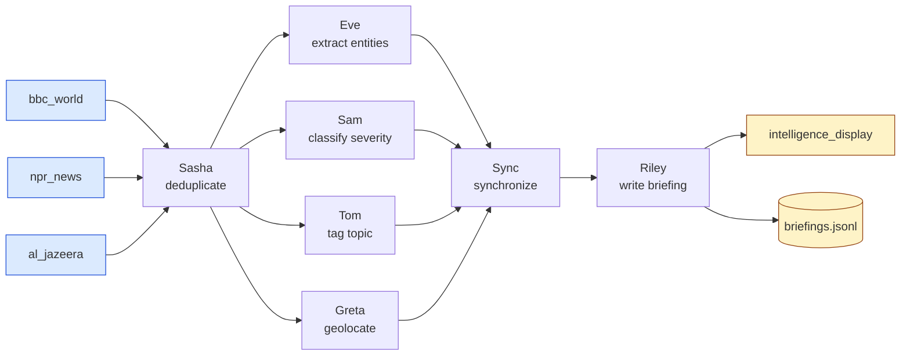

# DisSysLab

[](https://pypi.org/project/dissyslab/)
[](https://pypi.org/project/dissyslab/)
[](LICENSE)
[](https://github.com/kmchandy/DisSysLab/actions/workflows/test.yml)

**Use plain English to build a network of agents that monitor your world and react to it.**

DisSysLab is a framework for **sense-and-respond systems** that
monitor your environment and respond to changes in it. An app built with DisSysLab is an
**office** populated by agents. Each agent has one well-defined job. An office runs
continuously — sources monitor your environment (sensors, news, calendars, weather, 
audio, images); processing agents transform data streams; sinks (actuators, databases,
messages) receive data streams. 

Almost everybody has an idea of an office, job descriptions, 
and org charts. So I use the office and workers as analogies for networks and agents.
Unlike chatbots, an office doesn't wait for a prompt; after it is configured an
office runs continuously forever or until it receives done signals on all its inputs.


```mermaid
flowchart LR
  A[bbc_world]:::src --> D[Sasha<br/>deduplicate]
  B[npr_news]:::src --> D
  C[al_jazeera]:::src --> D
  D --> E1[Eve<br/>extract entities]
  D --> E2[Sam<br/>classify severity]
  D --> E3[Tom<br/>tag topic]
  D --> E4[Greta<br/>geolocate]
  E1 --> H[Sync<br/>synchronize]
  E2 --> H
  E3 --> H
  E4 --> H
  H --> I[Riley<br/>write briefing]
  I --> J[intelligence_display]:::sink
  I --> K[(briefings.jsonl)]:::sink
  classDef src fill:#dbeafe,stroke:#1d4ed8
  classDef sink fill:#fef3c7,stroke:#92400e
```

*The `situation_room` office. Each block in the diagram is an agent:
three news-feed sources fan into a deduplicator; four agents
enrich each article in parallel; a synchronizer merges their
outputs; a writer assembles and emits a report. Office
networks -- org charts -- can have loops, branches, and arbitrary structure.*

---

## Try it in 60 seconds

```bash
curl -sSf https://raw.githubusercontent.com/kmchandy/DisSysLab/main/install.sh | bash
```

Then, in a fresh terminal:

```bash
dsl run periodic_brief
```

No API key, no model download. In 10–20 seconds you get a styled
HTML brief from news headlines, current weather, and a few stock
tickers:

<p align="center">
  
</p>

`dsl list` shows every office that ships with DisSysLab. To make
your own editable copy of any of them:

```bash
dsl init periodic_brief my_brief
cd my_brief
dsl run .
```

Modify `office.md` or the role files inside `my_brief/roles/` and
rerun.
To see an interactive slide intro open [office_microcourse.html](office_microcourse.html).

---

## How an office is specified

The diagram above is generated from this `office.md`:

```
Sources: bbc_world(max_articles=5), npr_news(max_articles=5),
         al_jazeera(max_articles=5)
Sinks: intelligence_display, jsonl_recorder_briefing(...)

Agents:
Sasha is a deduplicator(by="url").
Eve is an entity_extractor.
Sam is a severity_classifier.
Tom is a topic_tagger.
Greta is a geolocator.
Sync is a synchronizer.
Riley is a writer.

Connections:
bbc_world's destination is Sasha.
npr_news's destination is Sasha.
al_jazeera's destination is Sasha.
Sasha's out is Eve, Sam, Tom, Greta.
Eve's out is Sync's entities.
Sam's out is Sync's severity.
Tom's out is Sync's topic.
Greta's out is Sync's location.
Sync's out is Riley.
Riley's out is intelligence_display, jsonl_recorder_briefing.
```

Every block in this office is a specialist agent. The **Sources**
section lists specialists that fetch data. The
**Sinks** section lists specialists that act on the environment. The
**Agents** section lists specialists that transform data streams.
The framework runs them all the same way.

Each agent's role is specified either as a job description in  English in a file called
`roles/<role>.md` or in Python in `roles/<role>.py`. An example of an English job
description is:

```
# Role: topic_tagger

You read one news article at a time and assign it to one of:
politics, business, technology, science, health, sports,
entertainment, other.

Preserve the original article. Add one new field, "topic",
whose value is one of the eight labels above.

Always send to out.
```

Use Python to specify a role when an English language job description is vague or 
inappropriate, and when you want to reduce calls to LLMs to reduce costs. For
example use Python for many signal processing tasks such as computing the 
RMS (root mean square) of a signal over a moving window. 

```
Agents:
Tom is a topic_tagger.        # English role; LLM does the work
Sasha is a deduplicator.      # Python role; deterministic
Alex is a bird_classifier.    # Python role; wraps an ML model
```

See [docs/](docs/README.md) for the full grammar and examples.

---

## Offices contain offices

Each office is a black box: the surrounding network only sees what
goes in and what comes out. You can build an office whose agents
are themselves offices, structuring a complex system as a network
of sub-offices — like a corporation has sub-departments. See
[docs/BUILD_APPS.md](docs/BUILD_APPS.md) section 7 for the worked
example.

---

## Mix and match AI per agent

Each specialist agent has a stable contract on its inputs and
outputs, so swapping the LLM that powers it does not change the office
org chart. **Each agent can run on a different LLM backend.** Specify
the backend in `office.md`:

```
Agents:
Eve is an entity_extractor.
Eve's AI is ollama.            # local, free — good enough for entity extraction
Sam is a severity_classifier.
Sam's AI is openrouter.        # cheap cloud
Riley is a writer.
Riley's AI is claude.          # high quality for the final briefing
```

Those three `AI is` sentences are the only difference between
*"all agents on Claude"* (uniform high cost) and *"a tiered system
that uses cheap models for routine work and Claude for the
synthesis step."*

Backends shipped today: `anthropic` (aliased `claude`), `openai`
(aliased `gpt`), `gemini`, `openrouter`, `ollama`. Each has
`_creative` and `_precise` variants for finer control over agent
temperature.

See [docs/LANGUAGE_MODELS.md](docs/LANGUAGE_MODELS.md) for the full
backend catalog.

---

## Cost and time per run

| Engine | Wall time per run | Cost per run |
|---|---|---|
| Ollama (local Qwen) | 15–30 min on a 32 GB Mac | $0 |
| OpenRouter (Qwen-2.5-7B) | 1–5 min, any laptop | pennies |
| Claude | 1–3 min, any laptop | tens of cents |

Estimates only; provider prices drift. Check the provider's pricing
page before relying on any specific figure.

Every shipped office stops after a few polling cycles by default —
long enough to see a result, short enough that you won't get a
large bill. Set `max_articles=N` and `max_readings=N` parameters
in each office's `office.md` to control execution. Remove these
only when you want continuous operation.

---

## Gallery examples

| App | What it does | Notable technique |
|---|---|---|
| [periodic_brief](dissyslab/gallery/apps/periodic_brief/) | Morning HTML brief: news + weather + tickers | Zero-LLM stream processing |
| [situation_room](dissyslab/gallery/apps/situation_room/) | News → multi-agent enrichment → digest | Five parallel agents, synchronizer |
| [arxiv_radar](dissyslab/gallery/apps/arxiv_radar/) | Daily arXiv papers → LLM rater → digest | Web-scraped source, LLM rating |
| [kalshi_market_watch](dissyslab/gallery/apps/kalshi_market_watch/) | Polls prediction markets → LLM briefing | External API + rate limiting |
| [backyard_birds](dissyslab/gallery/apps/backyard_birds/) | Audio classification of bird calls | BirdNET classifier in a Python role |
| [wildlife_watcher](dissyslab/gallery/apps/wildlife_watcher/) | Image classification of camera-trap photos | Image classifier with confidence filtering |
| loudness_monitor | Live audio stream → threshold → alert | Streaming sense-respond, no LLM |
| [recovery_demo](dissyslab/gallery/apps/recovery_demo/) | Monte Carlo π estimator with checkpoint-recovery | Distributed snapshot algorithm (Chandy-Lamport) |
| [job_hunter](https://github.com/Nyasha2/job-hunter) | RSS jobs → screen → match → tailored materials | Five-agent fan-out, structured output |
| [wardrobe_assistant](https://github.com/Nyasha2/wardrobe-assistant) | Calendar + weather → daily outfit recommendation | Multi-source fan-in, multi-stage pipeline |
| [calendar_manager](https://github.com/Nyasha2/calendar-manager) | Local events → matched against open slots in your calendar | Two-source fan-in, schedule matching |

`job_hunter`, `wardrobe_assistant`, and `calendar_manager` were
created and are maintained by Caltech undergraduate **Nyasha
Makaya**:

- [github.com/Nyasha2/job-hunter](https://github.com/Nyasha2/job-hunter)
- [github.com/Nyasha2/wardrobe-assistant](https://github.com/Nyasha2/wardrobe-assistant)
- [github.com/Nyasha2/calendar-manager](https://github.com/Nyasha2/calendar-manager)

Each of Nyasha's apps follows the same pattern: a DisSysLab office
(`office.md` + role files), a FastAPI backend that wraps `dsl run`,
and a React frontend. He uses `dissyslab` as a PyPI dependency.
Anybody can build sense-respond apps in the same way.

Enter `dsl list` to see apps shipped with this package. See
[gallery/README.md](dissyslab/gallery/README.md) for short demos
and patterns beyond the shipped slate.

---

## How it runs

Every specialist agent runs in its own thread by default. 
The framework manages messages between agents.
You can also run each agent in its own OS process if your
app is CPU intensive.

DisSysLab has no Python DAG definition step unlike some other
frameworks. Moreover, the network of agents need not be a DAG — it
can have loops. An app is specified in an English `office.md` and
role files (English `.md` or Python `.py`). The framework reads the
files and executes the app.

---

## Current limitations

What DisSysLab does **not** do in this release, named honestly so
new users do not infer promises the framework does not keep:

- **Single machine.** An office runs in one process (or one
  process per agent with `dsl run --processes`). Multi-machine
  distribution is on the v2.x roadmap.
- **Checkpoint-recovery is opt-in.** New in v1.6, the framework
  implements the Chandy-Lamport distributed snapshot algorithm;
  the `recovery_demo` gallery office demonstrates the protocol
  end-to-end. Other shipped offices use it as their authors add
  `save_state` / `load_state` methods on their stateful agents.
  See [docs/algorithms/CHECKPOINT_RESUME.md](docs/algorithms/CHECKPOINT_RESUME.md).
- **No first-party web UI.** [Nyasha Makaya](https://github.com/Nyasha2)
  ships React/FastAPI frontends on top of his three offices as
  the recommended deployment pattern for office authors who want
  a UI; the framework itself stays Python-only.

---

## Why I am building DisSysLab

Sense-and-respond systems have been used by large institutions for
decades. Militaries formalized them as the OODA loop (observe,
orient, decide, act). Stephan Haeckel introduced "sense and
respond" as a business methodology in 1992. In 2009, Roy Schulte of
Gartner and I published *Event Processing: Designing IT Systems for
Agile Companies* (Morgan Kaufmann), which surveys the field and
describes many use cases. I worked on two startups building S&R
systems, and helped build earthquake-warning and radiation-detection
systems. For an account of the earthquake-warning work, see
*Community Sense and Response Systems: Your Phone as Quake
Detector*, Communications of the ACM, July 2014. And for radiation
detection see *Sensor Networks for the Detection and Tracking of Radiation
and Other Threats in Cities* -  Information Processing in Sensor Networks (IPSN), 2011 

I saw the power of S&R systems. I want individuals — students,
small businesses, researchers — to harness that power.
S&R systems were used primarily by institutions because only they
had the expertise.
LLMs allow individuals to use English job descriptions to build 
and connect special-purpose agents to form offices.
LLMs can also write Python for special-purpose agents whose job
is deterministic — a sliding-window RMS, a deduplicator, an
ML-model wrapper. An individual does not have to be a programmer.


I am using DisSysLab to teach distributed system algorithms to
undergraduates, including students in disciplines
other than CS and first-year students. Each student uses DisSysLab to build
an S&R app for the student's specific interests. And then we study the
algorithms underlying the students' apps. The student's own app provides
added motivation to study topics such as termination detection,
global snapshots, block chain, and distributed consensus. For the
formal treatment of concurrent algorithms that informs the course,
see *Parallel Program Design: A Foundation*, K. Mani Chandy and
Jayadev Misra (Addison-Wesley, 1988).


---

## Documentation

- **[docs/README.md](docs/README.md)** — the user guide. Start
  here when you're ready to design your own office.
- **[gallery/README.md](dissyslab/gallery/README.md)** — the full
  app catalog with annotations.
- **[Sources and sinks reference](docs/SOURCES_AND_SINKS.md)** —
  the full catalog of inputs and outputs, including MCP-server
  integration: any tool with an MCP server (file system, GitHub,
  Brave search, etc.) can be a source or sink.
- **[Sample digest](dev/experiments/situation_room_sample_day_1.md)**
  — what a real morning's `situation_room` output looks like.
- **[CHANGELOG.md](CHANGELOG.md)** — what is new in each release,
  including the v1.6 distributed snapshot checkpoint-recovery.
- **[Deploy with Docker](docs/recipes/deploy-with-docker.md)** —
  run an office continuously in the cloud on a schedule
  (Docker + Railway, or cron + Docker on your own machine).

---

## Manual install (without the shell installer)

```bash
python3 -m venv .venv
source .venv/bin/activate   # Windows: .venv\Scripts\activate
pip install dissyslab

# periodic_brief runs immediately with no model or key:
dsl run periodic_brief
open brief.html
```

For offices with multiple agents (`situation_room`, `inbox_triage`, etc.) pick
a backend and export its credentials:

```bash
# Option A: local, free, slow. ~19 GB one-time model download.
ollama pull qwen3:30b
export DSL_BACKEND=ollama

# Option B: hosted Qwen-2.5-7B via OpenRouter. Pennies per run.
export DSL_BACKEND=openrouter
export OPENROUTER_API_KEY=sk-or-v1-...

# Option C: Claude. Tens of cents per run, highest quality.
export DSL_BACKEND=claude
export ANTHROPIC_API_KEY=sk-ant-...

dsl run situation_room
```

---

## Requirements

- macOS or Linux. Windows works for the core framework; the shell
  installer assumes a Unix-like environment.
- Python 3.10 or newer.
- For running `situation_room` locally on Ollama: a Mac with 32 GB
  RAM (or comparable PC) and ~20 GB free disk. Smaller machines
  can still run the lighter offices or point `DSL_BACKEND` at
  OpenRouter or another hosted backend.

---

## License

MIT — see [LICENSE](LICENSE).
