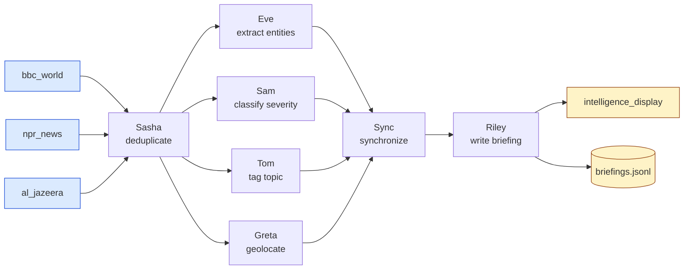

# DisSysLab

[](https://pypi.org/project/dissyslab/)
[](https://pypi.org/project/dissyslab/)
[](LICENSE)


**Goal: Make sense and respond (S&R) systems available to individuals — students, small businesses, researchers.**
S&R systems respond proactively to conditions in the environment. S&R has been used for decades by militaries, banks and institutions with powerful computers and teams of experts. DisSysLab attempts to make S&R available to a non-programmer with a laptop. 

DisSysLab is based on three ideas.

1. **Build an office of agents that responds to your environment continuously.**. A chatbot answers when you ask; use DisSysLab to build an office of agents that responds continuously to your environment. Populate your office with agents that carry out specialized processing tasks and agents that interface with your environment -- sensors, actuators, audio streams, news, and mail.
2.  **Describe your office in English.**
An office is specified by its workers and an org chart. Each worker's role is specified by a job description. The org chart specifies the flow of messages between workers. Workers are implemented as agents that execute concurrently in threads or processes. Job descriptions and the org chart are specified in English. 
3. **Mix and match agents that fit your accuracy, budget, and privacy needs.**
Build your office with a mix of free local AI (e.g. Qwen on Ollama), paid AI services (e.g. Anthropic, OpenAI, Gemini), task-specific small models, and Python functions to fit your needs.

**Teaching**:
I will be using DisSysLab to teach distributed systems to undergraduates, including first-year students. Students in all disciplines -- including the humanities, arts, and sciences — can use S&R because they monitor research paper archives, lab measurements, calendars and homework assignments. The course is open to all students including Computer Science students. The course begins with students buildings apps for their own specific needs. Only then do we investigate algorithms such as termination detection and global snapshots that underly their apps.


```mermaid
flowchart LR
  A[bbc_world]:::src --> D[Sasha<br/>deduplicate]
  B[npr_news]:::src --> D
  C[al_jazeera]:::src --> D
  D --> E1[Eve<br/>extract entities]
  D --> E2[Sam<br/>classify severity]
  D --> E3[Tom<br/>tag topic]
  D --> E4[Greta<br/>geolocate]
  E1 --> H[Sync<br/>synchronize]
  E2 --> H
  E3 --> H
  E4 --> H
  H --> I[Riley<br/>write briefing]
  I --> J[intelligence_display]:::sink
  I --> K[(briefings.jsonl)]:::sink
  classDef src fill:#dbeafe,stroke:#1d4ed8
  classDef sink fill:#fef3c7,stroke:#92400e
```


*The `situation_room` office: three news feeds fan into one
deduplicator, four parallel agents enrich each article, a synchronizer
merges their outputs, and a writer assembles and writes the briefing which
is sent to a terminal display and to a JSONL archive. Every node is
specified in one short English document.*


---

## Try it

This demo needs no API key and no model
download. [`periodic_brief`](dissyslab/gallery/apps/periodic_brief/)
pulls news, weather, and a few stock tickers and renders them into a
single, styled HTML page. It runs in a few seconds.

**One-line install** (macOS or Linux, requires Python 3.10+):

```bash
curl -sSf https://raw.githubusercontent.com/kmchandy/DisSysLab/main/install.sh | bash
```

The installer asks one question: which AI engine do you want?

- **Ollama** — free, local, private. Downloads a ~19 GB model
  (Qwen3) one time, takes 20–40 minutes. After that, $0 forever
  but slow: 15–60 min per office run on a typical Mac.
- **OpenRouter** — hosted Qwen-2.5-7B. Paste an API key from
  <https://openrouter.ai/keys>. A few cents covers a week of runs.
  Office runs finish in 1–5 minutes.
- **Claude** — Anthropic's hosted model. Paste an Anthropic key.
  Highest-quality output, ~25–50¢ per office run.

  **Note**: These costs are estimates. Check costs before running.

Pick an AI engine that fits. You can switch later by editing one line in
your shell rc file.

**Then: open a new terminal** (or run `source ~/.zshrc` on macOS /
`source ~/.bashrc` on Linux) so the new PATH takes effect.

**Now run your first office:**

```bash
dsl run periodic_brief
```

In 10–20 seconds you'll see a brief render in your terminal —
news headlines from BBC and NPR, current weather for Pasadena, and a
few stock tickers. A `brief.html` is also saved in the
current folder so you can share or archive it.

<p align="center">
  
</p>

To make your own editable copy of `periodic_brief` execute
```bash
dsl init periodic_brief my_brief
```
 You can then execute the office from your local folder by
 executing:

```bash
cd my_brief
dsl run .
```

`dsl list` shows offices that ship with DisSysLab.

## Build your own situation room

First see `periodic_brief` running end to end.
Then build your own situation room by running and
modifying [`situation_room`](dissyslab/gallery/apps/situation_room/).


```bash
dsl run situation_room
```

Three news feeds in. One intelligence digest out: articles deduplicated,
severity-classified, entity-extracted, topic-tagged, and geolocated.
Speed and cost depend on the engine you picked at install time:

| Engine | Wall time per run | Cost per run |
|---|---|---|
| Ollama (local Qwen) | 15–30 min on a 32 GB Mac | $0 |
| OpenRouter (Qwen-2.5-7B) | 1–5 min, any laptop | pennies |
| Claude | 1–3 min, any laptop | tens of cents |

> *Numbers above are estimates and will drift as providers update
> prices. Check the provider's pricing page before relying on any
> specific figure. You specify the agent types in your office;
> the actual bill is between you and the providers of the services
> that the office uses.*

**About cost safety.** Every office in the gallery stops after a
few polling cycles by default — long enough to see a result,
short enough that you won't get a large bill. Set
`max_articles=N` and `max_readings=N` parameters in each office's
`office.md` to control execution. Remove these only when you want
your office to run continuously.

You should see a digest like
[this sample](dev/experiments/situation_room_sample_day_1.md):

```markdown
## [CRITICAL] Lebanon reports 39 killed in Israeli strikes

*politics · Lebanon · middle_east*

Lebanon reports that Israeli strikes killed 39 people. Fighting
continues between Israel and Hezbollah despite a ceasefire deal
announced last month.

[bbc_world](https://www.bbc.com/news/...)
```

---

## Personalize your situation room

Change the roles, agents and org chart in
[`office.md`](dissyslab/gallery/apps/situation_room/office.md)
to fit your needs.
You may want to change one of the following:

**1. Sources** — swap a news feed for Gmail or a webhook; add or
remove a source entirely.

**2. Parallel thinkers** — add, remove, or replace the agents that
extract entities, severity, topic, location. Each one annotates
the message with one more fact.

**3. Writer** — change the prompt to produce a different style of
briefing: executive summary, technical alert, blog draft, customer
email.

**4. Sinks** — change where the result goes: terminal, markdown file,
or Slack channel.


## Examples of steps you may want to try

**Change parameters.** Bump article counts, swap a
feed, set a polling interval.

```
Sources: techcrunch(max_articles=10, poll_interval=600)
```

**Swap and add components.** Replace the terminal
display with a markdown file or add a topic filter agent.

```
Sinks: markdown_digest(path="~/digest.md")
```

**Write new job descriptions.** Describe new roles for your specific app.
See [`docs/BUILD_APPS.md`](docs/BUILD_APPS.md).

A worked example of the third tier — overriding *one* role to use
Claude while everything else stays on a cheap open model — is at
[`situation_room_pro`](dissyslab/gallery/apps/situation_room_pro/).
One file's difference.

---

## What's an office of agents?

An office is a team of AI agents and an
org chart. You give each agent a name and a role.
You write a job description in plain English for each role — the framework uses it as the agent's LLM prompt at runtime. You declare the agents and the org chart in `office.md`, a short configuration document with English-readable syntax. The framework compiles your description into a concurrent system.

Three layers of English live in DisSysLab:

- **Role descriptions** (the `roles/*.md` files in your office) are plain English, used directly as LLM prompts at runtime.
- **Conversational creation** (`dsl new`) lets you describe the office you want to Claude; Claude writes the configuration for you.
- **The configuration document** (`office.md`) is a short structured document with English-readable syntax. You can read and edit it directly.

This is a very brief overview of how you specify offices. 
We describe specifics elsewhere.
Here's `situation_room`'s wiring (excerpted from
[`office.md`](dissyslab/gallery/apps/situation_room/office.md)):

```
Sources: bbc_world(max_articles=5), npr_news(max_articles=5),
         al_jazeera(max_articles=5)
Sinks: intelligence_display, jsonl_recorder_briefing(...)

Agents:
Sasha is a deduplicator(by="url").
Eve is an entity_extractor.
Sam is a severity_classifier.
Tom is a topic_tagger.
Greta is a geolocator.
Sync is a synchronizer.
Riley is a writer.

Connections:
bbc_world's destination is Sasha.
npr_news's destination is Sasha.
al_jazeera's destination is Sasha.

Sasha's out is Eve, Sam, Tom, Greta.

Eve's out is Sync's entities.
Sam's out is Sync's severity.
Tom's out is Sync's topic.
Greta's out is Sync's location.

Sync's out is Riley.
Riley's out is intelligence_display, jsonl_recorder_briefing.
```

## The network of agents in the situation_room office

The diagram below restates the same topology in ASCII art, with timing semantics labeled.

```
        ┌──────────┐ ┌──────────┐ ┌──────────┐
        │ bbc_news │ │ npr_news │ │  al_jaz  │
        └────┬─────┘ └────┬─────┘ └────┬─────┘
             └────────────┼────────────┘
                          ▼         ← Asynchronous merge
                  ┌───────────────┐
                  │    Sasha      |
                  | deduplicator  │
                  └───────┬───────┘
                          ▼ broadcast 
      ┌─────────────┌─────────┐────────----──┐
      ▼             ▼           ▼            ▼
 ┌──────────┐ ┌──────────┐ ┌──────────┐ ┌──────────┐
 │   Eve    | |    Sam   | |    Tom   | |  Greta   |
 | extract  | |determine | |  topic   | |determine |
 |entities  │ │ severity │ | tagger   | |location  |     
 └────┬─────┘ └────┬─────┘ └────┬─────┘ └────┬─────┘
      ▼            ▼            ▼            ▼             ← Synchronous merge 
  ┌───────----------------------------------────────┐
  │                     Sync                        │
  │                 synchronizer                    │               
  └─────----------------──┬─────------------------──┘
                          ▼
                  ┌───────────────┐
                  │    Riley      │
                  │    writer     │
                  └───────┬───────┘
                          ▼
                   ┌──────┴──────┐
                   ▼             ▼
              ┌──────────┐  ┌──────────┐
              │ display  │  │ archive  │
              └──────────┘  └──────────┘
```

The office monitors the feeds listed as `Sources`.
The office output is displayed in the console as `intelligence_display` and
stored to a file `jsonl_recorder_briefing` as specified in `Sinks`.
The office has agents called Eve, Sam, Tom, Greta, Sync, and Riley.
The roles of agents in the office are deduplicator, entity_extractor, 
severity_classifier, topic_tagger, geo_locator, synchronizer, and
writer. 

**Connections** specifies the org chart or how information flows in the
office. The line `Eve is an entity_extractor` specifies that the agent
called `Eve` has the `entity_extractor` role.
In this office each role is filled by exactly one agent. 
In other offices, there may be multiple agents with the same role;
for example there may be an agent that identifies topics in news sources
and a different agent that identifies topics in competitors' websites,
and both agents may have the same job description.

An agent can have multiple inboxes in which incoming messages are placed
and multiple outboxes in which the agent places its outgoing messages.
The framework sends messages from outboxes to inboxes as specified in
`Connections`. Most agents have a single inbox called **in** and a single
outbox called **out**. A synchronizer can have multiple inboxes.

The line `Sasha's out is Eve, Sam, Tom, Greta.` says that messages from
Sasha's outbox are broadcast to the inboxes of Eve, Sam, Tom and Greta. 
Messages from multiple outboxes can feed the same inbox. For example,
messages from the three sources feed Sasha's inbox. The delay between
a message appearing in an outbox and its delivery to its connected inbox
is arbitrary. Performance issues are described later.

## Example of a role
Specify a role — its job description — with sufficient detail
that agents in the role do what you want them to do. Here is an example of
a job description for topic taggers

```
# Role: topic_tagger

You read one news article at a time and assign it to one of
a fixed set of topic categories.

Input shape. Each article is a JSON object with these keys:

- "source"    — name of the feed (string)
- "title"     — headline (string)
- "text"      — article body (string)
- "url"       — link to the article (string)
- "timestamp" — publication time (string)

Your job. Add one new field, "topic", whose value is one of
exactly these eight strings:

- "politics"      — government, elections, diplomacy, war.
- "business"      — markets, companies, industry, trade.
- "technology"    — software, hardware, AI, internet, science
  applied to commerce or daily life.
- "science"       — research findings in physics, biology,
  medicine, climate, space — when not tied to a product.
- "health"        — public health, medicine, healthcare
  policy, pandemics.
- "sports"        — competitive athletics and games.
- "entertainment" — film, TV, music, celebrity, gaming.
- "other"         — anything that does not clearly fit one of
  the seven above. Use this when you would have to guess.

Preserve every existing field exactly; only add the new
"topic" field.

Rules:

- Pick exactly one topic per article. Do not output a list.
- Use the exact spelling above (lowercase).
- When in doubt, prefer "other" rather than guessing.

Always send to out.

Output. Return a single JSON object that includes every
field of the input plus the new "topic" field, plus a
"send_to" field whose value is "out". Do not include
explanations, markdown code fences, or any text outside the
JSON object.

Example.

Input:

{"source": "techcrunch", "title": "AI startup raises $50M to automate code review", "text": "Series B funding led by Sequoia values the company at $400M...", "url": "https://techcrunch.com/2026/04/15/ai-startup", "timestamp": "2026-04-15T10:00:00Z"}

Output:

{"source": "techcrunch", "title": "AI startup raises $50M to automate code review", "text": "Series B funding led by Sequoia values the company at $400M...", "url": "https://techcrunch.com/2026/04/15/ai-startup", "timestamp": "2026-04-15T10:00:00Z", "topic": "technology", "send_to": "out"}
```

---

*Note: Agents for most apps can be specified in English; however,
some require Python.*
Users will need to resort to Python less frequently as
LLMs integrate with Python libraries. 


---

## Apps and examples

Modify examples of offices in the [`gallery`](dissyslab/gallery/).

- **[`gallery/apps/`](dissyslab/gallery/apps/)** — ready-to-run
  offices, organised by whether they need an API key.
  - [`periodic_brief`](dissyslab/gallery/apps/periodic_brief/) —
    no-key, no-LLM HTML brief: news + weather + tickers. The
    ten-second demo.
  - [`situation_room`](dissyslab/gallery/apps/situation_room/) —
    the headline office: three news feeds → intelligence digest.
    Nine plain-English agents in sense → think → respond.
  - [`situation_room_pro`](dissyslab/gallery/apps/situation_room_pro/)
    — same office, Claude as the writer for top quality,
    open-weight Qwen everywhere else.
  - See [`gallery/README.md`](dissyslab/gallery/README.md) for the
    full menu (inbox triage, ticket router, competitor watch, lead
    qualifier, new-grad jobs, etc.).

- **[`gallery/examples/`](dissyslab/gallery/examples/)** — smaller
  tech demos showing patterns (sub-offices, custom roles, custom
  sinks). Useful when you start writing your own offices.

`dsl list` from the terminal groups every office by section.

---


## Why I am building DisSysLab

S&R systems have been used by large institutions for decades. Militaries
formalized them as the OODA loop (observe, orient, decide, act).
Stephan Haeckel introduced "sense and respond" as a business
methodology in 1992. In 2009, Roy Schulte of Gartner and I published
*Event Processing: Designing IT Systems for Agile Companies*,
surveying the field and describing many use cases. I worked on building
earthquake-warning and radiation-detection systems.


**I am building DisSysLab to make S&R available to an individual with a personal computer** --
an amateur investor, a researcher who wants timely updates on new findings,
a facilities manager who monitors water leaks, and an individual managing
social media, mail and calendars. 
S&R systems were not available to individuals for two reasons: individuals didn't
have access to teams of experts and to adequate computing power.

1. **Expertise**: Institutions develop S&R systems over multiple iterations. Business users describe their intent:
*Build a system that responds to critical events in a timely fashion without generating
many false alarms.* Teams of data scientists and engineers built prototype systems that are tested by
business users. If the intent is not met engineers iterate on the next prototype.
Individuals don't have programming teams.

2. **Compute Power**: Organizations built S&R systems using powerful computing
infrastructure. Militaries and banks use networks of multiprocessor computers.
Individuals have only personal computers.

DisSysLab uses LLMs to overcome both hurdles.
You use LLMs to implement specialized S&R tasks
such as filtering, entity identification, and signal processing.
You tune prompts to do these special-purpose tasks extremely well.
Then you use English to specify how the agents cooperate to execute
complex S&R missions. You control costs by running some
free, smaller LLMs on a PC while running others on hosted services (Anthropic,
Gemini, OpenAI). You can even use LLMs to build the entire office of agents
given S&R specifications.

**DisSysLab for Teaching**:
I have taught courses on concurrency for 40 years. Now first-year
undergraduates are interested in concepts that
were previously taught in graduate courses. I am teaching a course open to first-year
undergraduates in the coming year. Each student begins by using DisSysLab to build an S&R app for her own 
personal needs. Then I discuss algorithms underlying the systems
they built.

---

## Documentation

Running offices:

- **[`gallery/README.md`](dissyslab/gallery/README.md)** — the full
  app catalog, split into "runs on any laptop with no keys" and
  "shines on a hosted backend".
- **[`situation_room/README.md`](dissyslab/gallery/apps/situation_room/README.md)**
  — what the office does, what's in its office.md line by line, and
  the three-tier staircase for making it yours.
- **[Sample digest](dev/experiments/situation_room_sample_day_1.md)**
  — what a real morning's output looks like.

Building new offices:

- **[`docs/BUILD_APPS.md`](docs/BUILD_APPS.md)** — design and wire
  your own office, from idea to running system.
- **[`docs/LANGUAGE_MODELS.md`](docs/LANGUAGE_MODELS.md)** —
  switching, comparing, and mixing backends.
- **[`docs/SOURCES_AND_SINKS.md`](docs/SOURCES_AND_SINKS.md)** —
  every source and sink component the framework ships with.
- **[`docs/recipes/`](docs/recipes/)** — short copy-pasteable
  patterns for common tasks.
- **[`docs/MAKE_OFFICE.md`](docs/MAKE_OFFICE.md)** — the
  programmatic path: construct an office from Python.

Extending the framework:

- **[`dev/PROMPTING_FOR_SLMS.md`](dev/PROMPTING_FOR_SLMS.md)** — the
  role-decomposition pattern that makes small models reliable.

---

## Manual install (without the shell installer)

If you'd rather not run a `curl | bash`:

```bash
# 1. Install DisSysLab
python3 -m venv .venv
source .venv/bin/activate   # Windows: .venv\Scripts\activate
pip install dissyslab

# 2. Try periodic_brief now — no model, no key, just runs
dsl run periodic_brief
open brief.html
```

That gives you a working office in under a minute. To unlock the
heavier offices (`situation_room`, `inbox_triage`, etc.) pick an
engine and configure it:

```bash
# Option A: local, free, slow. ~19 GB one-time model download.
# Install Ollama from https://ollama.com/download, then:
ollama pull qwen3:30b
export DSL_BACKEND=ollama

# Option B: hosted Qwen-2.5-7B via OpenRouter. Pennies per run.
export DSL_BACKEND=openrouter
export OPENROUTER_API_KEY=sk-or-v1-...
export OPENROUTER_MODEL=qwen/qwen-2.5-7b-instruct

# Option C: Claude. ~25–50¢ per run, highest quality.
export DSL_BACKEND=claude
export ANTHROPIC_API_KEY=sk-ant-...

# Then run any office in the gallery
dsl run situation_room
```

Same result as the shell installer. Read each step before running it.

---

## A Python Distributed Systems Framework for Teaching

DisSysLab -- distributed systems laboratory -- is used 
in an introductory undergraduate class on distributed
systems. First, students build sense and 
respond apps for their own specific personal needs. 
The apps provide motivation for learning concurrency concepts.
See [`docs/MAKE_OFFICE.md`](docs/MAKE_OFFICE.md).

---

## Requirements

- macOS or Linux. Windows works for the core framework, but the
  shell installer assumes a Unix-like environment.
- Python 3.10 or newer.
- For running `situation_room` locally on Ollama: a Mac with 32 GB
  RAM (or comparable PC) and ~20 GB free disk. Smaller machines
  can still run the lighter offices or point `DSL_BACKEND` at
  OpenRouter or another hosted backend.

---


## License

MIT — see [LICENSE](LICENSE).

---
