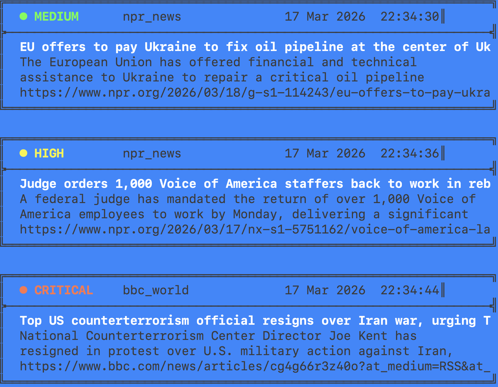

# DisSysLab — Build Your Own Office of AI Agents

**AI chatbots answer when you ask. DisSysLab runs an office of AI agents
that works for you continuously** — monitoring sources, filtering,
analyzing, and delivering results all the time, until you tell it to stop.

You describe the office in plain English. DisSysLab builds it.



*A Situation Room scanning live news and social media in real time.
You didn't write any code. You wrote two plain English documents.*

---

## Choose your path

**I want to run offices of AI agents** (no need to understand the framework internals)
→ jump to **[Path A — pip install](#path-a--run-offices-of-ai-agents)** below.

**I want to learn how distributed systems work, or contribute to DisSysLab**
→ jump to **[Path B — git clone](#path-b--learn-how-dsl-works)** below.

---

## Path A — Run Offices of AI Agents

Install from PyPI:

```bash
pip install dissyslab
dsl doctor
```

`dsl doctor` checks your Python, the dependencies, and whether your
Anthropic API key is set. Get a key at https://console.anthropic.com.

### Run your first office

```bash
dsl list
dsl init org_intelligence_briefing my_briefing
cd my_briefing
echo "ANTHROPIC_API_KEY=your-key-here" > .env
dsl run .
```

`dsl list` shows every office that ships with DisSysLab. `dsl init` copies
one of them into a folder you own. From there, edit prompts, connect
sources, rewire agents — the office is yours.

### What is an office?

An office is a team of AI agents with roles, connected by an org chart.
You write each role in plain English — the same way you'd describe a job
to a new hire — and you write the org chart in plain English too.

**The job description — what each agent does:**

```
# Role: analyst

You are a news analyst who receives posts and articles and sends
items to an editor or a discard.

Your job is to decide if each item is relevant to significant
political developments or economic events — specifically involving
topics such as Congress, elections, the Federal Reserve, tariffs,
inflation, markets, trade policy, or the broader economy.

Exclude celebrity gossip, sports, entertainment, and personal
opinions with no broader political or economic significance.

If the item is relevant, send to editor.
Otherwise send to discard.
```

**The org chart — who connects to whom:**

```
Sources: bluesky(max_posts=None, lifetime=None),
         al_jazeera(max_articles=10, poll_interval=600),
         bbc_world(max_articles=10, poll_interval=600)
Sinks: intelligence_display(max_items=8),
       jsonl_recorder(path="situation_room.jsonl")

Agents:
Alex is an analyst.
Morgan is an editor.

Connections:
bluesky's destination is Alex.
al_jazeera's destination is Alex.
bbc_world's destination is Alex.
Alex's editor is Morgan.
Alex's discard is jsonl_recorder.
Morgan's situation_room are intelligence_display and jsonl_recorder.
```

That's it. Change the topics, change the agents, change the sources.
The office is yours.

**Offices can contain offices.** Each office is a black box — the
organization around it only sees what goes in and what comes out. You
build organizations of arbitrary complexity one office at a time, reusing
offices across different networks.

### Next steps for Path A

- Walk through the [5-minute micro-course](https://kmchandy.github.io/DisSysLab/office_microcourse.html)
- Browse every shipped office with `dsl list`
- Read the office-by-office tour in [`dissyslab/gallery/README.md`](dissyslab/gallery/README.md)

---

## Path B — Learn How DSL Works

Interested in how DisSysLab works under the hood? DSL is also a Python
framework for building distributed systems — concurrent agents, message
queues, routing, and termination detection.

```bash
git clone https://github.com/kmchandy/DisSysLab.git
cd DisSysLab
pip install -e '.[dev]'
pytest
```

See [`examples/`](examples/README.md) for a module sequence that takes you
from your first network to building distributed systems from scratch:

- `module_01` — your first Agent and Network
- `module_02` — sources, transforms, sinks
- `module_03` — fan-out, fan-in, routing
- `module_04` — termination and the os_agent
- ...

Contributions welcome. Open an issue or a pull request on
[GitHub](https://github.com/kmchandy/DisSysLab/issues).

---

## Requirements

- Python 3.9 or newer
- An Anthropic API key ([get one here](https://console.anthropic.com))

## License

MIT — see [LICENSE](LICENSE).

---

*DisSysLab is an open research project exploring natural language
interfaces to persistent distributed systems.*
