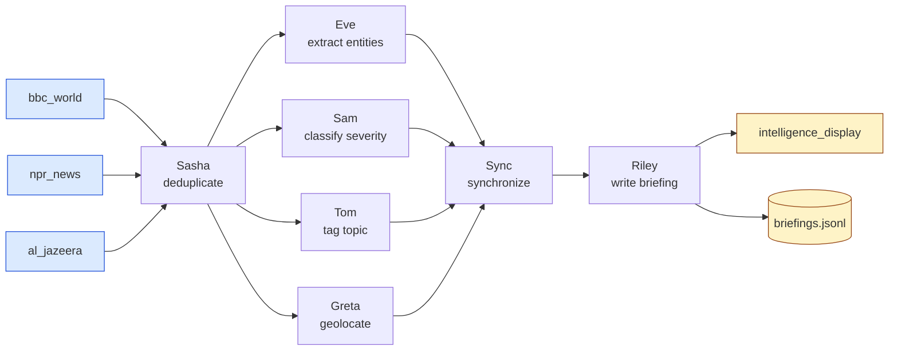
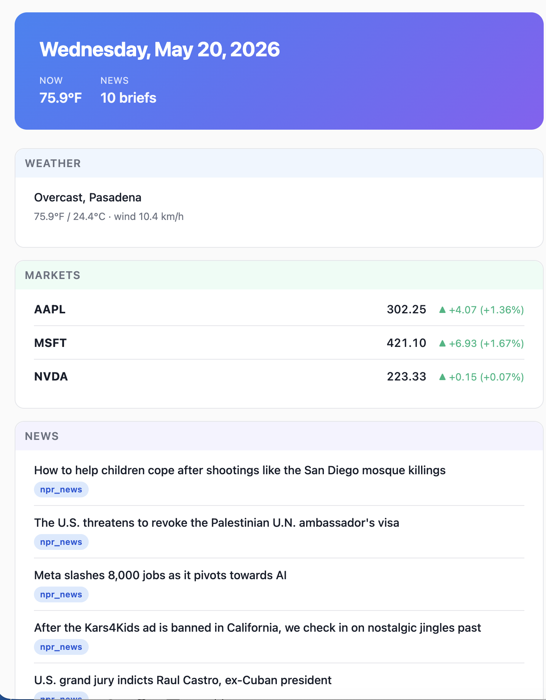

# DisSysLab

[](https://pypi.org/project/dissyslab/)
[](https://pypi.org/project/dissyslab/)
[](LICENSE)

**Use English to build offices of AI agents that watch your world and act.**

DisSysLab is a framework for **sense-and-respond systems** that
monitor your environment -- news feeds, calendars, weather, sensors, audio,
or images -- and respond proactively. Unlike chatbot frameworks, an
**office runs continuously.** 


```mermaid
flowchart LR
  A[bbc_world]:::src --> D[Sasha<br/>deduplicate]
  B[npr_news]:::src --> D
  C[al_jazeera]:::src --> D
  D --> E1[Eve<br/>extract entities]
  D --> E2[Sam<br/>classify severity]
  D --> E3[Tom<br/>tag topic]
  D --> E4[Greta<br/>geolocate]
  E1 --> H[Sync<br/>synchronize]
  E2 --> H
  E3 --> H
  E4 --> H
  H --> I[Riley<br/>write briefing]
  I --> J[intelligence_display]:::sink
  I --> K[(briefings.jsonl)]:::sink
  classDef src fill:#dbeafe,stroke:#1d4ed8
  classDef sink fill:#fef3c7,stroke:#92400e
```

*The `situation_room` office: three news feeds fan into one
deduplicator; four parallel agents enrich each article; a
synchronizer merges their outputs; a writer assembles and emits the
briefing. Org charts of offices
can have loops, branches, and arbitrary topology.*

---

## Try it in 60 seconds

```bash
curl -sSf https://raw.githubusercontent.com/kmchandy/DisSysLab/main/install.sh | bash
```

Then, in a fresh terminal:

```bash
dsl run periodic_brief
```

No API key, no model download. In 10–20 seconds you get a styled
HTML brief from news headlines, current weather, and a few stock
tickers:

<p align="center">
  
</p>

`dsl list` shows every office that ships with DisSysLab. To make
your own editable copy of any of them:

```bash
dsl init periodic_brief my_brief
cd my_brief
dsl run .
```

Modify `office.md` or the role files inside `my_brief/roles/` and
rerun. The development loop is *edit English; rerun*.

---

## How an office is specified

The diagram above is generated from this `office.md`:

```
Sources: bbc_world(max_articles=5), npr_news(max_articles=5),
         al_jazeera(max_articles=5)
Sinks: intelligence_display, jsonl_recorder_briefing(...)

Agents:
Sasha is a deduplicator(by="url").
Eve is an entity_extractor.
Sam is a severity_classifier.
Tom is a topic_tagger.
Greta is a geolocator.
Sync is a synchronizer.
Riley is a writer.

Connections:
bbc_world's destination is Sasha.
npr_news's destination is Sasha.
al_jazeera's destination is Sasha.
Sasha's out is Eve, Sam, Tom, Greta.
Eve's out is Sync's entities.
Sam's out is Sync's severity.
Tom's out is Sync's topic.
Greta's out is Sync's location.
Sync's out is Riley.
Riley's out is intelligence_display, jsonl_recorder_briefing.
```

Each agent's job description lives in `roles/<role>.md`, as plain
English. Here's a deliberately small example:

```
# Role: topic_tagger

You read one news article at a time and assign it to one of:
politics, business, technology, science, health, sports,
entertainment, other.

Preserve the original article. Add one new field, "topic",
whose value is one of the eight labels above.

Always send to out.
```

The specification consists of an `office.md` that specifies
sources, agents, sinks, and their connections; and a `roles/<role>.md` file that describes
a role -- a job description. Write and run your own office and roles.

See [docs/](docs/README.md) for the full grammar and a worked
walk-through of a more substantial role.

---

## Mix and match AI per agent

**Each agent can run on a
different LLM backend**. Specify the backend in English in `office.md`.

```
Agents:
Eve is an entity_extractor.
Eve's AI is ollama.            # local, free — good enough for entity extraction
Sam is a severity_classifier.
Sam's AI is openrouter.        # cheap cloud
Riley is a writer.
Riley's AI is claude.          # high quality for the final briefing
```

Those three `AI is` sentences are the only difference between
*"all agents on Claude"* (uniform high cost) and *"a tiered system
that uses cheap models for routine work and Claude for the
synthesis step"*. 
Backends shipped today: `anthropic` (aliased `claude`),
`openai` (aliased `gpt`), `gemini`, `openrouter`, `ollama`. Each
has `_creative` and `_precise` variants for finer control over
agent temperature.

See [docs/LANGUAGE_MODELS.md](docs/LANGUAGE_MODELS.md) for the full
backend catalog.

---

## Cost and time per run

| Engine | Wall time per run | Cost per run |
|---|---|---|
| Ollama (local Qwen) | 15–30 min on a 32 GB Mac | $0 |
| OpenRouter (Qwen-2.5-7B) | 1–5 min, any laptop | pennies |
| Claude | 1–3 min, any laptop | tens of cents |

Estimates only; provider prices drift. Check the provider's pricing
page before relying on any specific figure.

Every shipped office stops after a few polling cycles by default —
long enough to see a result, short enough that you won't get a
large bill. Set `max_articles=N` and `max_readings=N` parameters
in each office's `office.md` to control execution. Remove these
only when you want continuous operation.

---

## Gallery examples

| App | What it does | Notable technique |
|---|---|---|
| backyard_birds *(in development)* | Audio classification of bird calls | ML model agent, no LLM |
| wildlife_watcher *(in development)* | Image classification of camera-trap photos | ML model agent, no LLM |
| [periodic_brief](dissyslab/gallery/apps/periodic_brief/) | Morning HTML brief: news + weather + tickers | Zero-LLM stream processing |
| [situation_room](dissyslab/gallery/apps/situation_room/) | News → multi-agent enrichment → digest | Five parallel agents, synchronizer |
| [arxiv_radar](dissyslab/gallery/apps/arxiv_radar/) | Daily arXiv papers → LLM rater → digest | Web-scraped source, LLM rating |
| [job_hunter](https://github.com/Nyasha2/job-hunter) | RSS jobs → screen → match → tailored materials | Five-agent fan-out, structured output |
| [kalshi_market_watch](dissyslab/gallery/apps/kalshi_market_watch/) | Polls prediction markets → LLM briefing | External API + rate limiting |
| [wardrobe_assistant](https://github.com/Nyasha2/wardrobe-assistant) | Calendar + weather → daily outfit recommendation | Multi-source fan-in, multi-stage pipeline |

`job_hunter` and `wardrobe_assistant` are created by
Caltech undergraduate **Nyasha Makaya**, who maintains his own
versions — plus a third app, **calendar_manager** (Los Angeles
event discovery that matches LA listings against your calendar) —
in standalone repos:

- [github.com/Nyasha2/job-hunter](https://github.com/Nyasha2/job-hunter)
- [github.com/Nyasha2/wardrobe-assistant](https://github.com/Nyasha2/wardrobe-assistant)
- [github.com/Nyasha2/calendar-manager](https://github.com/Nyasha2/calendar-manager)

Each of Nyasha's apps follows the same pattern: a DisSysLab office
(`office.md` + role prompts), a FastAPI backend that wraps
`dsl run`, and a React frontend. He uses `dissyslab` as a PyPI
dependency rather than a fork. That's the deployment pattern
DisSysLab is designed to support — anybody can build their own
sense-respond apps in their own repos, optionally putting a web UI
on top. Nyasha's repos are the example.

Enter `dsl list` to see apps shipped with this package. See
[gallery/README.md](dissyslab/gallery/README.md) for short demos
and patterns beyond the shipped slate.

---

## How it runs

Every agent runs in its own thread by default. Sources poll
independently on their own schedule. Sinks consume independently.
The framework manages the queues that connect them. For CPU-bound
work (numpy, local ML inference), use `dsl run --processes` and
every agent runs in its own OS process.

**DisSysLab has no Python DAG definition step** unlike some
other frameworks. Moreover, the network (org chart) of agents need not
be a DAG -- it can have loops. An app is specified in an English
file `office.md` and role `.md` files. The framework reads the
files and executes the app.

---

## Why I am building DisSysLab

Sense-and-respond systems have been used by large institutions for
decades. Militaries formalized them as the OODA loop (observe,
orient, decide, act). Stephan Haeckel introduced "sense and
respond" as a business methodology in 1992. In 2009, Roy Schulte
of Gartner and I published *Event Processing: Designing IT Systems
for Agile Companies*, which surveys the field and describes many
use cases. I worked on two startups building S&R systems, and
helped build earthquake-warning and radiation-detection systems.

I saw the power of S&R systems. I want individuals — students,
small businesses, researchers — to harness that power.

I am using DisSysLab to teach distributed system algorithms to
undergraduates including first-year students. Each student uses
DisSysLab to build an S&R app for the student's specific interests.
And then we study the algorithms underlying the students' apps.


---

## Documentation

- **[docs/README.md](docs/README.md)** — the user guide. Start
  here when you're ready to design your own office.
- **[gallery/README.md](dissyslab/gallery/README.md)** — the full
  app catalog with annotations.
- **[Sample digest](dev/experiments/situation_room_sample_day_1.md)**
  — what a real morning's `situation_room` output looks like.

---

## Manual install (without the shell installer)

```bash
python3 -m venv .venv
source .venv/bin/activate   # Windows: .venv\Scripts\activate
pip install dissyslab

# periodic_brief runs immediately with no model or key:
dsl run periodic_brief
open brief.html
```

For offices with multiple agents  (`situation_room`, `inbox_triage`, etc.) pick
a backend and export its credentials:

```bash
# Option A: local, free, slow. ~19 GB one-time model download.
ollama pull qwen3:30b
export DSL_BACKEND=ollama

# Option B: hosted Qwen-2.5-7B via OpenRouter. Pennies per run.
export DSL_BACKEND=openrouter
export OPENROUTER_API_KEY=sk-or-v1-...

# Option C: Claude. Tens of cents per run, highest quality.
export DSL_BACKEND=claude
export ANTHROPIC_API_KEY=sk-ant-...

dsl run situation_room
```

---

## Requirements

- macOS or Linux. Windows works for the core framework; the shell
  installer assumes a Unix-like environment.
- Python 3.10 or newer.
- For running `situation_room` locally on Ollama: a Mac with 32 GB
  RAM (or comparable PC) and ~20 GB free disk. Smaller machines
  can still run the lighter offices or point `DSL_BACKEND` at
  OpenRouter or another hosted backend.

---

## License

MIT — see [LICENSE](LICENSE).
