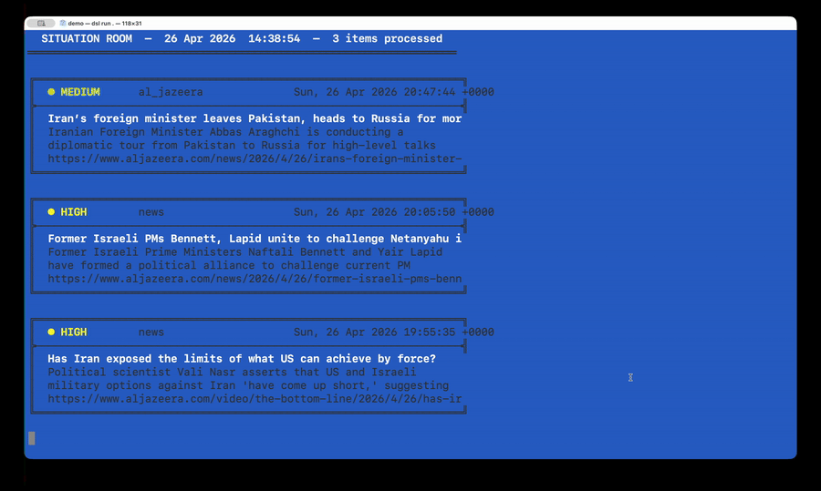

# DisSysLab — Build Your Own Office of AI Agents

[](https://pypi.org/project/dissyslab/)
[](https://pypi.org/project/dissyslab/)
[](LICENSE)
[](https://pypi.org/project/dissyslab/)

**An AI chatbot answers when you ask. DisSysLab runs an office of AI
agents that works for you continuously** — monitoring Hacker News,
BlueSky, your inbox; filtering, analyzing, and delivering results around
the clock until you tell it to stop.

You describe the office in plain English. DisSysLab compiles your
description into a running distributed system.



*`org_situation_room` running live: five concurrent agents scanning
news and social media. Alex filters for political and economic
significance; Morgan rewrites each keeper as a briefing. No code —
just two plain-English files describing what each agent does and how
they connect.*

### Try it in 60 seconds

```bash
python3 -m venv .venv && source .venv/bin/activate    # Windows: .venv\Scripts\activate
pip install dissyslab
export ANTHROPIC_API_KEY=sk-ant-...                   # need a key? see Path A below
dsl init my_first_office my_briefing && cd my_briefing && dsl run .
```

Within seconds, briefings start streaming to your terminal:

```
[Alex]   ML release: a 7B model that runs on a Raspberry Pi 5 with
         usable latency — full weights and training code on GitHub.

[Alex]   New Python release: 3.13 ships with a no-GIL build behind
         a flag. Big deal for compute-bound libraries.

[Alex]   Skip: yet another startup announcing a Series B; nothing
         technical here.
```

*Three briefings written by an AI agent named Alex, watching Hacker
News in real time. You didn't write any code — you wrote two short
plain-English files describing what Alex does.*

### Two ways to start

- **Run it now** — copy the three commands above. Full step-by-step
  walkthrough with the API-key setup is in
  [Path A](#path-a--run-offices-of-ai-agents) below.
- **Watch first** — take the
  [5-minute micro-course](https://kmchandy.github.io/DisSysLab/office_microcourse.html)
  to see what you're building before you install.

---

## Who this is for

**Anyone who knows basic Python and can run `pip install`.** If
you've used `python3` from a terminal and you have an Anthropic API
key (or are willing to spend three minutes getting one), you can build
offices of AI agents with DisSysLab.

The mission is to show the world how to build **offices** —
distributed systems of cooperating agents — in natural language, with
LLMs doing the heavy lifting. No frameworks to learn, no asyncio, no
message queues to wire by hand. You write job descriptions and an org
chart; DisSysLab handles threading, message passing, and shutdown.

---

## Choose your path

**I want to run offices of AI agents** (no need to understand the
framework internals)
→ jump to **[Path A — pip install](#path-a--run-offices-of-ai-agents)** below.

**I want to learn how distributed systems work, or contribute to DisSysLab**
→ jump to **[Path B — git clone](#path-b--learn-how-dsl-works)** below.

---

## Path A — Run Offices of AI Agents

**Ten minutes from `pip install` to a running office.** Three steps.

### 1. Install

```bash
mkdir ~/dsl-tutorial && cd ~/dsl-tutorial
python3 -m venv .venv
source .venv/bin/activate
pip install dissyslab
```

(On Windows, replace `source .venv/bin/activate` with
`.venv\Scripts\activate`.)

**Already have DisSysLab installed?** Force the latest release
and bypass pip's wheel cache:

```bash
pip install --upgrade --no-cache-dir dissyslab
```

### 2. Set your Anthropic API key

Get a key at [console.anthropic.com](https://console.anthropic.com)
(Settings → API Keys → Create Key). Copy it to your clipboard, then:

```bash
export ANTHROPIC_API_KEY=$(pbpaste)
```

(`pbpaste` is Mac. On Linux use `xclip -selection clipboard -o` or
`xsel -b`. In Windows PowerShell use `Get-Clipboard`.) To make it
permanent, add the same `export` line to `~/.zshrc` or `~/.bashrc`.

### 3. Run your first office

```bash
dsl init my_first_office my_briefing
cd my_briefing
dsl run .
```

Within a few seconds the compiler shows you the office's topology and
asks for confirmation. Type `yes` and one-sentence Hacker News
briefings start streaming to your terminal. Press `Ctrl+C` to stop.

### Here's the file you just ran

Two plain-English files, no Python. The org chart is `office.md`:

```
# Office: my_first_office

Sources: hacker_news(max_articles=10, poll_interval=600)
Sinks: console_printer

Agents:
Alex is an analyst.

Connections:
hacker_news's destination is Alex.
Alex's briefing is console_printer.
```

The role description is `roles/analyst.md`:

```
# Role: analyst

You are a Hacker News analyst. For each story you receive, write
one crisp sentence describing what it's about and why someone
learning software might care.

Send to briefing.
```

That's the entire program. DisSysLab read those two files, started
a Hacker News source thread, started Alex on his own thread with the
plain-English job description as his prompt, and forwarded each
briefing to your terminal.

### Modify and re-run

Open `roles/analyst.md` and change one line — give Alex a different
audience, a different focus, a different style.

```
You are a Hacker News analyst. Your readers are first-year computer
science students learning Python, AI, and data science. ...
```

Save. Run `dsl run .` again. Same office, completely different
behavior. No rebuild, no code change. **That's the whole idea.**

For a longer walkthrough — installing, setting the key, running both
offices end-to-end with explanations of every step — see
[`GETTING_STARTED.md`](GETTING_STARTED.md).

### A tour of the gallery

```bash
dsl list
```

prints every office that ships with DisSysLab. Some highlights:

| Office | What it does |
|--------|--------------|
| `my_first_office` | Single-agent Hacker News briefer (the one above) |
| `org_situation_room` | Two-agent live news monitor — BlueSky + BBC + Al Jazeera, with a live-updating display of the eight most recent briefings |
| `org_news_editorial` | Two-agent editorial chain — analyst feeds editor, with a feedback loop |
| `weather_monitor` | Single-agent weather briefer for a city you choose |
| `stocks_monitor` | Single-agent ticker watcher with one-sentence price updates |
| `org_two_office_news` | An office of offices — news_monitor feeds news_editor, sourced from three real RSS feeds |

> **Heads-up on cost.** Offices run continuously until you stop them.
> An office that polls live feeds will keep calling Claude — and
> billing your Anthropic account — for as long as it's open. Press
> `Ctrl+C` when you're done, and check your usage at
> [console.anthropic.com](https://console.anthropic.com) if you've
> left one running for a while.

Each office is a folder with an `office.md` and `roles/*.md` you can
read and edit. `dsl init <office_name> <local_folder>` copies one
into a folder you own.

### What is an office?

An office is a team of AI agents with **roles**, connected by an
**org chart**. You write each role in plain English — the same way
you'd describe a job to a new hire — and you write the org chart in
plain English too.

Here's a richer example, from `org_situation_room`. Alex filters live
news for political and economic significance; Morgan rewrites
keepers as briefings.

**The job description — what each agent does:**

```
# Role: analyst

You are a news analyst who receives posts and articles and sends
items to either keep or discard.

Your job is to decide if each item is relevant to significant
political developments or economic events — Congress, elections,
the Federal Reserve, tariffs, inflation, markets, trade policy,
or the broader economy.

Exclude celebrity gossip, sports, entertainment, and personal
opinions with no broader political or economic significance.

If the item is relevant, send to keep.
Otherwise send to discard.
```

**The org chart — who connects to whom:**

```
Sources: bluesky(max_posts=None, lifetime=None),
         al_jazeera(max_articles=10, poll_interval=600),
         bbc_world(max_articles=10, poll_interval=600)
Sinks: intelligence_display(max_items=8),
       jsonl_recorder_discard(path="discards.jsonl"),
       jsonl_recorder_briefing(path="briefings.jsonl")

Agents:
Alex is an analyst.
Morgan is an editor.

Connections:
bluesky's destination is Alex.
al_jazeera's destination is Alex.
bbc_world's destination is Alex.
Alex's keep is Morgan.
Alex's discard is jsonl_recorder_discard.
Morgan's briefing are intelligence_display and jsonl_recorder_briefing.
```

That's the entire program. Three sources stream concurrently; Alex
and Morgan each run on their own thread; Alex's discards stream to
one archive on disk while Morgan's briefings stream to another and
also feed the live display. Change the topic, change the filter,
change the sources — the office is yours.

**Offices can contain offices.** Each office is a black box —
the surrounding network sees only what flows in and what flows out.
You build organizations of arbitrary complexity one office at a time,
reusing offices across networks.

### Documentation

- **5-minute micro-course** — [watch first](https://kmchandy.github.io/DisSysLab/office_microcourse.html)
  to see what an office looks like before you install.
- **Recipes** — copy-pasteable patterns:
  [filter for a topic](docs/recipes/filter-for-a-topic.md),
  [monitor your inbox](docs/recipes/monitor-your-inbox.md),
  [receive webhooks](docs/recipes/receive-webhooks.md),
  [chain offices](docs/recipes/chain-offices.md),
  [send messages to email/Slack/files](docs/recipes/send-messages-outside.md),
  [write a custom role](docs/recipes/write-a-custom-role.md), and
  [more](docs/recipes/).
- **Sources and sinks reference** — [docs/SOURCES_AND_SINKS.md](docs/SOURCES_AND_SINKS.md)
  lists every component the framework ships with, with arguments and
  setup instructions.
- **Use a different LLM** (OpenAI, Gemini, Ollama, a local SLM) —
  [docs/LANGUAGE_MODELS.md](docs/LANGUAGE_MODELS.md) walks through the
  `DSL_BACKEND_MODULE` extension hook, mixing backends in one
  office, and comparing models.
- **Build your own office** —
  [docs/BUILD_APPS.md](docs/BUILD_APPS.md) covers the design and
  wiring path from idea to running app.
- **Hit an error?** — run `dsl doctor`, then check
  [docs/TROUBLESHOOTING.md](docs/TROUBLESHOOTING.md) for the
  remedy keyed on the error string.
- **Browse offices** — `dsl list` from the terminal, or the
  [gallery README](dissyslab/gallery/README.md).
- **Full docs index** — [docs/README.md](docs/README.md).

---

## Path B — Learn How DSL Works

DSL is also a Python
framework for building distributed systems — concurrent agents, message
queues, routing, and termination detection. You can clone the repository;
run an example; and then use the framework in Python as follows.

```bash
git clone https://github.com/kmchandy/DisSysLab.git
cd DisSysLab
python3 -m venv ~/.venvs/dsl
source ~/.venvs/dsl/bin/activate
pip install -e '.[dev]'
pytest
echo "ANTHROPIC_API_KEY=<paste-your-key>" > .env
dsl run dissyslab/gallery/my_first_office/
```

The source ~/.venvs/dsl/bin/activate line activates the venv for the current shell only. 
**When you open a new terminal you must re-run the activate command before running dsl.**
If you use Windows then the activate command is .venv\Scripts\activate and the path 
uses backslashes.

See [`examples/`](examples/README.md) for a module sequence for using
Python to building distributed systems:

- `module_01` — your first Agent and Network
- `module_02` — sources, transforms, sinks
- `module_03` — fan-out, fan-in, routing
- `module_04` — termination and the os_agent
- ...


---

## Requirements

- Python 3.9 or newer
- An Anthropic API key ([get one here](https://console.anthropic.com))

## License

MIT — see [LICENSE](LICENSE).

---

**DisSysLab is an open research and teaching project. It is a
framework for building distributed systems using natural language.
It allows you to explore, compare, and use different large and
small language models in the same application. It is used in an introductory, 
first= or second-year undergraduate course on distributed systems.**

