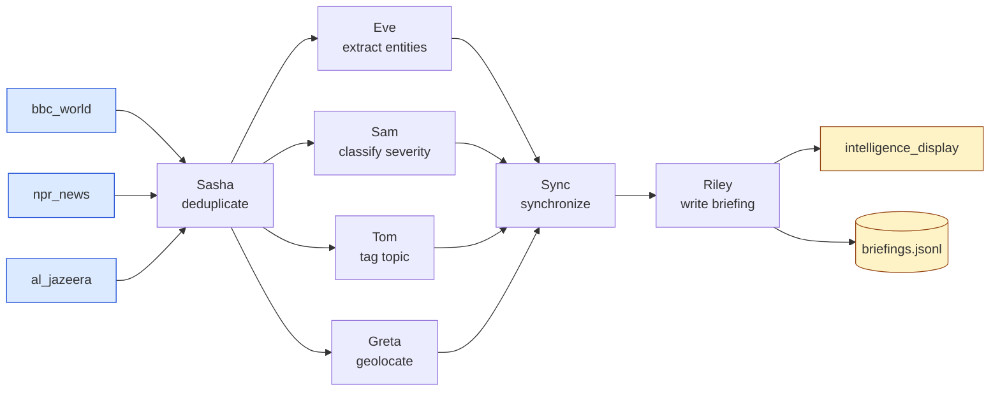

# DisSysLab

[](https://pypi.org/project/dissyslab/)
[](https://pypi.org/project/dissyslab/)
[](LICENSE)
[](https://github.com/kmchandy/DisSysLab/actions/workflows/test.yml)

**Build persistent, concurrent applications by talking to an AI agent
which assembles the apps from tested libraries.**

---


**Coding assistants for Concurrent Apps**: 
AI coding assistants such as Claude Cowork, Codex and Gemini CLI generate code for
persistent, concurrent applications. You can generate any app by talking to the
assistant in plain English; however, AI assistants may not generate correct programs
because concurrency introduces problems that aren't in sequential programs. For example,
straightforward operations in sequential programs - such as detecting that a computation
has terminated - are not straightforward in concurrent programs.

**Skills for Concurrent Apps**:
DisSysLab is a set of libraries that AI assistants can use to build persistent,
concurrent applications. The libraries contain Python programs,
instructions to the assistant, and test suites. You describe the application in
English to the assistant. The assistant states what it assumed if your description is
incomplete. You correct the assistant; the conversation continues until the assistant
describes an application that matches the one you want. The assistant assembles
the concurrency machinery — message passing, termination detection, checkpointing, rollback and
recovery — instead of attempting to generate the machinery itself.

**Test Suites in Skills**: 
We can reason about the correctness of the concurrency components that the assistant used
to assemble the application because we wrote the components. However, you don't know how
the assistant generated the rest of the code. So, the libraries include suites of tests
that help you test both the parts of the app and the entire ensemble.

**Distributed Systems as Offices**: 
A distributed system is represented as an office - a network of agents. An agent sends and
receives messaegs. The network specifies how messages flow between agents. Offices are
described in detail later.

---


## Start here


You need Claude Cowork - the Claude desktop app - and Python 3.10 (or
newer), and nothing else, to get started. 

**1. Cowork on your computer.** When you start a task in Cowork you
can run it *on your computer* or *in the cloud*. Choose **on your
computer**.


**2. Install the library.**

Tell Cowork:

> *Install the Python package `dissyslab` for me, then run `dsl list`
> and show me what offices come with it.*

You should see about forty applications listed. If anything looks
wrong, tell Cowork

>  run `dsl doctor` and tell me what it says.

**3. Run one of pre-build apps.**

Tell Cowork:

> *Make me my own copy of the `periodic_brief` office in a folder
> called `my_brief`, then run it and open the result.*

Ten to twenty seconds later you have an HTML page built from live news
headlines and current weather. That is the whole of the first run: no
key, no account, no model download.

**4. Give your assistant the skill.** The first two steps ran a pre-built
application. To build your own app,  the assistant needs the skill to 
assemble offices from components in the DisSysLab library. Without the
skill the assistant will improvise its own concurrency constructs.

Tell Cowork:

> *Install the `office-builder` skill from
> github.com/kmchandy/DisSysLab and follow it when you build offices
> for me.*

Then check that the assistant got the skill by asking it:

> *Which version of the office-builder skill do you have?*

The assistant should answer with a dated string such as `2026-08-19.385377d`.
Anything that is vague implies that the assistant didn't get the skill; in
tell the assistant to reload the skill and tell you if it fails and why it
fails.


**5. Specify what to sense and how to respond: Examples** 

These are examples of sentences that you can tell Cowork to start 
building apps.

> *Watch the BBC and NPR news feeds and give me one page each morning
> with the headlines and the weather.*

The next app requires a large language model. You can use Claude, OpenAI,
Gemini or any of the free LLMs. Tell Cowork:

> *Watch three tech-news feeds and tell me when a competitor is
> mentioned.*

The next app needs access to your email account and LLMs

> *Rate my unread email by urgency and draft replies to the routine
> ones.*

The next requires a folder of bird-call recordings and a bird-call model.

> *Listen to my garden recordings and tell me which birds are there.*

The assistant asks what it needs to know, builds the application,
checks it, runs it, and shows you the output. You write no code, and
you change it by saying what should be different, for example  
— *"add the weather for Pasadena too"*,

[course/SETUP.md](course/SETUP.md) is the same path at more length,
with what to do when a step misbehaves. **Students** begin at
[`course/START_HERE.md`](course/START_HERE.md). **Contributors** begin
at [`CONTRIBUTING.md`](CONTRIBUTING.md).

---

## Example applications

Each of the sentences above corresponds to an application that ships
with the library. There are forty of them. If you want to build an
app similar to the ones in the list then start with it and tell the
assistant to modify it.

| | Examples |
|---|---|
| **Watching the world** | news briefings, an arXiv radar, a competitor watch, a weather monitor |
| **Your own day** | a morning page, inbox triage, a wardrobe assistant |
| **Money and markets** | a ticker read in plain English, a backtester, a paper trader |
| **Work and operations** | job matching, ticket routing, lead qualification, shipment release |
| **The physical world** | bird calls from recordings, animals in camera-trap photos, room climate, a loudness alarm |
| **Learning and argument** | an adaptive tutor, a structured debate |

`dsl list` shows all of them once the library is installed, and
[`course/START_HERE.md`](course/START_HERE.md) describes each one.

Some offices have agents that need LLMs, and in other offices all agents execute Python and
don't use LLMs. If an agent uses an LLM you can specify which one: a free local model
through Ollama, or a hosted one. See
[`docs/LANGUAGE_MODELS.md`](docs/LANGUAGE_MODELS.md).

---

## What a skill adds to an AI assistant

The DisSysLab library has components for dealing with conucurrency.
Message passing, construction of networks of agents, distributed
termination detection, checkpointing and recovery come from the library,
and are not generated afresh by AI assistants for each app.

You can extend an app -- add, modify, or remove components in a
distributed app -- by continuing a conversation with the AI assistant.
When the app is modified the skilled assistant automatically runs 
tests to check the entire app after it has been modified.
For example, we describe an app that helps you develop new stock-trading strategies
and test them on historical data. Each time you develop a new strategy
the skilled assistant checks that the strategy does not use future prices to 
determine current trades. The tests are built into the skill without
knowing how apps will be constructed or modified.


---

### What it costs

The library is free and so is running it. Some applications use only 
Python and no LLMs -- these apps are free. Others need a language model
for example to determine whether the sentiment of an article is positive.
You have two choices there, and the assistant will set either up for you. A
model running on your own machine (Ollama) is free and needs no
account, but requires a reasonably recent laptop. A hosted model needs an
account and costs a few cents per day for a person's typical morning
brief containing news, weather and simple analysis. You can build applications
that use different LLMs; for instance using free models for simple
steps and a paid ones only where necessary.

Every application from this repository stops after a few cycles. 
This is so that you don't run up a large bill for using LLMs.
Most of the apps are designed to run forever and you can tell the app to do so.
[`docs/LANGUAGE_MODELS.md`](docs/LANGUAGE_MODELS.md) has the details.

---

## What was built

Nothing in this section is needed in order to start. It describes the
artifact the assistant produces, and how to read it.

The assistant writes an **office**: a network of agents, each with one
job. Sources fetch from the world, agents transform the stream, and
sinks act on the result. An office runs continuously.

The office below reads three news feeds, removes duplicates, extracts
four kinds of information in parallel, waits for all four, and writes a
briefing.


```mermaid
flowchart LR
  A[bbc_world]:::src --> D[Sasha<br/>deduplicate]
  B[npr_news]:::src --> D
  C[al_jazeera]:::src --> D
  D --> E1[Eve<br/>extract entities]
  D --> E2[Sam<br/>classify severity]
  D --> E3[Tom<br/>tag topic]
  D --> E4[Greta<br/>geolocate]
  E1 --> H[Sync<br/>synchronize]
  E2 --> H
  E3 --> H
  E4 --> H
  H --> I[Riley<br/>write briefing]
  I --> J[intelligence_display]:::sink
  I --> K[(briefings.jsonl)]:::sink
  classDef src fill:#dbeafe,stroke:#1d4ed8
  classDef sink fill:#fef3c7,stroke:#92400e
```

The diagram is generated from the office's `office.md`, which is the
whole program:

```
Sources: bbc_world(max_articles=3), npr_news(max_articles=3), al_jazeera(max_articles=3)
Sinks: intelligence_display, jsonl_recorder_briefing(path="briefings.jsonl")

Agents:
Sasha is a deduplicator(by="url").
Eve is an entity_extractor.
Sam is a severity_classifier.
Tom is a topic_tagger.
Greta is a geolocator.
Sync is a synchronizer(inboxes=["entities", "severity", "topic", "location"]).
Riley is a writer.

Connections:
bbc_world's destination is Sasha.
npr_news's destination is Sasha.
al_jazeera's destination is Sasha.
Sasha's out is Eve, Sam, Tom, Greta.
Eve's out is Sync's entities.
Sam's out is Sync's severity.
Tom's out is Sync's topic.
Greta's out is Sync's location.
Sync's out is Riley.
Riley's out is intelligence_display, jsonl_recorder_briefing.
```

**You do not write this file. You read it.** The agent writes it; the
office is the record of what was built, and reading it is how you check
that the assistant built what you meant. It is also what you revise by
conversation: you say what should change, and the assistant changes the
file.

Each agent's job is either an English description in `roles/<name>.md`,
run by a language model, or Python in `roles/<name>.py`, which is
deterministic and costs nothing to run. English suits jobs that need
judgment. Python suits jobs that are exact.

Two further properties. An office is a black box with inboxes and
outboxes, so an office may contain offices. And each agent names its own model backend
— `Eve's AI is ollama.` alongside `Riley's AI is claude.` — so an
application need not be uniformly expensive. The supported backends are
`anthropic`, `openai`, `gemini`, `openrouter` and `ollama`.

---

## Why the language is small

`dsl check` reports an office's structural faults before it runs: an
inbox nothing writes to, an agent nothing can reach, work that reaches
no sink, a sink nothing feeds, a role with no file behind it, a source
or sink name that is in no registry, a feedback loop with no gate.

```bash
dsl check my_office
```

This is the reason `office.md` has a narrow grammar. The language is
small and rigid not so that a person can write it, but so that
`dsl check` can catch what a language model got wrong before the office
runs. A more expressive language would be pleasanter to write by hand
and would defeat its own purpose: the narrower the grammar, the more of
a generated office can be checked mechanically.

The check is structural. It cannot see faults that depend on what
happens at run time. An office whose diagram is correct can still
deadlock, because whether a message is ever readable may depend on
execution history rather than on the graph. That boundary is one of the
subjects the course treats.

---

## Running an office without an assistant

The library runs on its own. The following installs it, copies a
shipped office into a folder you own, and runs it.

```bash
pip install dissyslab
dsl init periodic_brief my_brief
cd my_brief && dsl run .
```

No API key, no account, and no model download. After ten to twenty
seconds the office has written a styled HTML brief from live news
headlines and current weather.

<p align="center">
  
</p>

This is the library shown by hand, not the intended way to use it. It
is here as evidence that the machinery is real and runs without an
account.

`dsl list` shows the shipped offices — 31 applications and 9 smaller
examples. `dsl doctor` checks an installation and runs a small office
as a self-test. Use `dsl init` rather than running a shipped office
where it sits, so that its output does not land inside the installed
package.

---

## Domain libraries, and the tests they carry

The concurrency library is domain-independent. Above it sit libraries
for particular application spaces, which add that space's components
and — the point of the opening's last paragraph — that space's tests.
A domain knows the mistakes it characteristically makes, and can check
for them in code it did not write.

The domain library that is built is trading. It holds a backtester and a paper
trader, and its skill in
[`dissyslab/gallery/apps/paper_trader/skill/`](dissyslab/gallery/apps/paper_trader/skill/)
runs three checks on a strategy the skill's author never saw: that the
strategy meets the interface contract, that it is deterministic, and
that it does not use a day's future prices to make that day's decision.
The last is the look-ahead error, which flatters a strategy on history
and fails it in practice.

This is the pattern the project claims transfers: a domain expert
contributes their field's components and their field's characteristic
mistakes, and inherits the concurrency machinery. One domain is built.
That is one instance, and not yet evidence that the pattern
generalises.

---

## Current limitations

Stated plainly, so that no one infers a promise the software does not
keep.

- **Single machine.** An office runs in one process with each agent in
  a thread. Per-agent process parallelism does not work. The intended
  unit is a whole office, which is designed but not built
  ([`docs/internals/design/process_per_office_design.md`](docs/internals/design/process_per_office_design.md)).
  Distribution across machines is roadmap.
- **Checkpoint-recovery is opt-in.** The Chandy–Lamport distributed
  snapshot is implemented, and
  [`recovery_demo`](dissyslab/gallery/apps/recovery_demo/) demonstrates
  it end to end. An office has it where the author of a stateful agent
  has added `save_state` and `load_state`.
- **Deadlock detection does not exist.** `dsl check` finds structural
  faults only.
- **Domain checks are not proofs.** They catch the mistakes a domain
  knows it makes. They do not establish that what the assistant built is
  what you meant. The conversation does that, and you remain in it.
- **One domain library exists.** Trading is built and tested. No
  others are.
- **No first-party web UI.** Offices produce files: HTML, JSONL, text.
- **Platforms.** Linux and macOS are supported and in CI. Windows runs
  and is in CI, with setup notes in
  [`docs/WINDOWS.md`](docs/WINDOWS.md).

---

## Why I am building this

Sense-and-respond systems have been used by large institutions for
decades. Militaries formalised them as the OODA loop. Stephan Haeckel
introduced "sense and respond" as a business methodology in 1992. In
2009 Roy Schulte and I published *Event Processing: Designing IT
Systems for Agile Companies* (Morgan Kaufmann). I worked on two
startups building such systems, and helped build earthquake-warning and
radiation-detection systems; see *Community Sense and Response Systems:
Your Phone as Quake Detector*, CACM, July 2014.

Those systems belonged to institutions because only institutions had
the expertise and the compute. Language models change that. A person
can describe an office in plain English and rely on tested machinery
for the parts that are hard to get right.

I am using this to teach distributed algorithms to undergraduates,
including first-year students. Each student builds a system for
something they care about, and we then study the algorithms holding it
up: termination detection, global snapshots, consensus. The framework
implements the Chandy–Lamport snapshot algorithm, and for the formal
treatment behind the course see *Parallel Program Design: A
Foundation*, K. Mani Chandy and Jayadev Misra (Addison-Wesley, 1988).

---

## Repository map

| Path | Contents |
|---|---|
| [`skills/`](skills/) | Skills an agent loads to build offices |
| [`course/`](course/) | The course: setup, what you build, the catalogue |
| [`docs/`](docs/) | Reference: components, backends, algorithms, internals |
| [`dissyslab/`](dissyslab/) | The library and the gallery |
| [`tests/`](tests/) | The suite; CI runs it on Python 3.10–3.14 |
| [`archive/`](archive/) | Dated documents, kept but not maintained |

---

## Install from source

```bash
git clone https://github.com/kmchandy/DisSysLab.git
cd DisSysLab
python3 -m venv .venv && source .venv/bin/activate
pip install -e ".[dev]"
dsl doctor && pytest tests/ -q
```

Note the `[dev]`. A plain `pip install -e .` runs offices but omits the
test tools. Python 3.10 or newer. Market-data offices need the optional
extra: `pip install "dissyslab[market]"`.

For offices with language-model agents, choose a backend and export its
credentials; see [`docs/API_KEY_SETUP.md`](docs/API_KEY_SETUP.md) and
[`docs/LANGUAGE_MODELS.md`](docs/LANGUAGE_MODELS.md). Every shipped
office stops after a few cycles by default, so a run will not
accumulate cost unattended.

---

## License

MIT; see [LICENSE](LICENSE).
