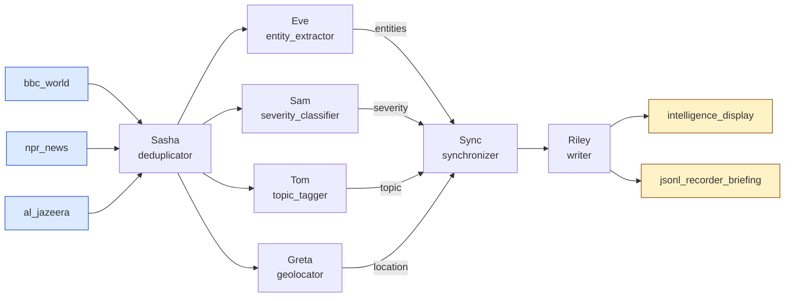

# DisSysLab

[](https://pypi.org/project/dissyslab/)
[](https://pypi.org/project/dissyslab/)
[](LICENSE)
[](https://github.com/kmchandy/DisSysLab/actions/workflows/test.yml)

**Build multi-agent applications.**

DisSysLab is a Python library and a set of skills that AI assistants — Claude Cowork, Codex, Gemini CLI — can use to build distributed applications in which many agents run concurrently. These applications can monitor data sources - news, sensors, and social media - and respond by sending messages to actuators, consoles and files. The applications can also process data sets such as historic stock and weather records. 

An AI assistant builds an application by assembling components from the library. The library contains the machinery for concurrent computation - messages, agents, termination detection, checkpointing, crash recovery. The library has been tested with different types of apps. Components of the library have clear specifications and test suites. An AI assistant can build applications without the library; however, then AI has to generate concurrency machinery from scratch for each new app. 

A distributed system is represented by an office in which everyone works remotely. Each agent - worker - in the office receives messages from its inboxes and puts messages in its outboxes. An agent cannot communicate in any other way. The office network specifies connections from outboxes to inboxes. The system removes a message from an outbox and sends copies of the message to each inbox to which it is connected. Offices are described in detail below.


---

## 1. Examples

Here are two examples of building distributed apps. The first builds an office by using primitives of an office - agents, connections, and roles. The second is for a finance "quant" who develops concurrent stock-trading strategies without explicitly using the office infrastructure.

### Use office primitives

Install Claude Cowork on your laptop and chooses **on your
computer** rather than in the cloud when given that option. 

**1.** Start a task in Cowork.

**2.** Input the following:

> *The project is at https://github.com/kmchandy/DisSysLab. Install its
> Python package `dissyslab` for me, then run `dsl doctor`.*

**3.** Input:

> *Install the `office-builder` skill from that repository, then run
> `dsl doctor` again.*

`dsl doctor`'s first line is a verdict: `Ready. You can build an
office.` or `Not ready:` and the one thing that is wrong. Its
**Skills** section names each skill, its version, and the folder it
was found in — or every folder it looked in, if it found none. Do not
ask the assistant which version it has; where a skill lives is a
question about the filesystem.

**4.** Now carry out a conversation with Cowork. Here is an example conversation.

Input:

> *Give me an office with agents Dan and Jay.*

```
# Office: draft

Agents:
Dan is unassigned.
Jay is unassigned.
```

> The office has an agent called Dan with an unassigned role, and an
> agent called Jay with an unassigned role. Tell me more about the
> office.

You said two names and nothing else, and two names is what was written
down. No source you did not ask for, no sink, no guess about what Dan
might do, and no menu of jobs to choose from.

> *Dan reads the space news and keeps only the ones about Mars.*

```
Dan is a relevance_filter.
```

Alongside it the assistant writes `roles/relevance_filter.md` — the
library's version of that role with its criteria rewritten to say
"about Mars". Dan's job is a paragraph of English she can read and
edit.

> *Jay writes one sentence about each one Dan keeps. Show me them on
> the screen.*

```
# Office: mars_watch

Sources: nasa_news(max_articles=10)
Sinks: console_printer, discard

Agents:
Dan is a relevance_filter.
Jay is a summarizer.

Connections:
nasa_news's destination is Dan.
Dan's keep is Jay.
Dan's discard is discard.
Jay's out is console_printer.
```

> No gaps. Your office runs.

Three sentences. Dan and Jay are separate agents that share nothing
and can only send each other messages; the office keeps running and
checks for new stories on its own; and when there is nothing left to
do it works that out and stops. Su wrote none of that and can read all
of it.

Su picked space. The same three sentences build the same office around
anything that publishes a feed — a game's update notes, a football
club, a webcomic — by pointing it at the address:
`rss(url="...", name="patch_notes")`.

<p align="center">
  
</p>

## Vikram, who tests trading strategies and does not read Python

**1.** Start a task, **on your computer**.

**2.** Say:

> *The project is at https://github.com/kmchandy/DisSysLab. Install its
> Python package `dissyslab` with the market extra, then run
> `dsl doctor`.*

The market extra carries the price downloader and the spreadsheet
writer. `dsl doctor` reports whether both arrived.

**3.** Say:

> *Make me a copy of the `mac_speed_suite` backtester in a folder
> called `my_backtest`, then download ten years of prices for the
> tickers it uses.*

That runs `dsl init` and then `dsl fetch-prices --office my_backtest`,
which reads the basket out of the office's own source line, skips
anything already downloaded, and finishes by loading each ticker back
through the office to confirm it can read what was just written.

**Nothing in this repository ships market data.** The vendor's terms
do not permit redistributing it, so every user fetches their own —
which is why the downloader lives in an extra you install deliberately.

**4.** Ask for what you want to see:

> *Show me the working for the Donchian 20 strategy on NVDA.*

You get an Excel workbook: one row per trading day, every quantity the
strategy computed on the way to its decision — not just the signal but
the upper and lower channel — and a sentence at the end of each row
saying which rule fired. *"close 121.8 > upper 119.4 — go long."*

Each computed quantity appears twice: once as the number the Python
produced, and once as a live Excel formula over the price cells, with
a column comparing the two. Click a shaded cell and the formula bar
reads `=MAX(C2:C21)` — the channel is built from the twenty rows
*above* this one, not this one. A boundary convention that is
ambiguous in English, invisible in a chart, and decides whether a
backtest was honest. Change a price and those shaded columns recompute.

The signal column does not: it is a number, not a formula, because for
two of the four strategies the position depends on the whole path and
no cell formula could compute it. The office's README carries a live
signal column you can paste in for the two where it is possible.

To be straight about what that does and does not give you: both
columns are one person's reading of the rule, written twice. If the
rule was misread, both are wrong together. What the formula gives you
is a specification you can read without reading Python.

## Forty offices to start from

| | |
|---|---|
| **Watching the world** | news briefings, an arXiv radar, a competitor watch, a weather monitor |
| **Your own day** | a morning page, inbox triage, a wardrobe assistant |
| **Money and markets** | a ticker read in plain English, a backtester, a paper trader |
| **Work and operations** | job matching, ticket routing, lead qualification, shipment release |
| **The physical world** | bird calls from recordings, animals in camera-trap photos, room climate, a loudness alarm |
| **Learning and argument** | an adaptive tutor, a structured debate |

`dsl list` shows all forty — 31 applications and 9 smaller examples —
and [course/START_HERE.md](course/START_HERE.md) describes each one.
The quickest way to something you want is to start from the nearest
one and say what should be different.

[course/SETUP.md](course/SETUP.md) is the same path at more length,
with what to do when a step misbehaves. **Students** begin at
[course/START_HERE.md](course/START_HERE.md). **Contributors** begin
at [CONTRIBUTING.md](CONTRIBUTING.md).

---

# 2. What is in it

## The library

Everything an application needs in order to keep running and pass
messages, written once and tested: agents as threads with named
inboxes and outboxes, the network that connects them, distributed
termination detection, the Chandy–Lamport global snapshot for
checkpoint and resume, and a library of sources, sinks and roles to
build from. `dsl list` shows the shipped offices; `dsl roles` the
built-in roles and the field each one adds; `dsl skills` which skills
are installed and where; `dsl check` reads an
office and reports its structural faults without running it;
`dsl draw` renders it; `dsl doctor` checks an installation.

## The skills

A skill is a folder of instructions an assistant loads — an open
format, the same `SKILL.md` in Claude Code, Codex and Gemini CLI.
DisSysLab has two kinds.

**The basic skills** know how to build an office: the grammar, the
role library, the sources and sinks, and the check-and-fix loop.
`office-builder` covers offices in general and
`sensor-office-builder` covers the shape where a model classifies a
signal.

**Domain skills** add a field's components and, more to the point, a
field's characteristic mistakes as checks that run against code the
check's author never saw. Trading is the one that exists. Before a
strategy is traded on, three mechanical checks run: that it produces
one finite signal per bar, that it is deterministic, and that it does
not use tomorrow's prices to make today's decision — the last verified
by recomputing on truncated history and failing if any earlier
decision moves once later bars are added.

Look-ahead bias is not a concurrency bug. It is a finance bug, and
only someone who knows finance knows to check for it. That is the
pattern the project is exploring: a domain expert contributes their
field's parts and their field's suspicions, and inherits the
concurrency. One domain exists. One instance is not evidence that a
pattern generalises.

## What the assistant writes

An **office** is a network of agents, each with one job. Sources fetch
from the world, agents transform the stream, sinks act on the result.
The office below reads three news feeds, removes duplicates, extracts
four kinds of information in parallel, waits for all four, and writes
a briefing.


```mermaid
flowchart LR
  bbc_world[bbc_world]
  npr_news[npr_news]
  al_jazeera[al_jazeera]
  Sasha[Sasha<br/>deduplicator]
  Eve[Eve<br/>entity_extractor]
  Sam[Sam<br/>severity_classifier]
  Tom[Tom<br/>topic_tagger]
  Greta[Greta<br/>geolocator]
  Sync[Sync<br/>synchronizer]
  Riley[Riley<br/>writer]
  intelligence_display[intelligence_display]
  jsonl_recorder_briefing[jsonl_recorder_briefing]
  bbc_world --> Sasha
  npr_news --> Sasha
  al_jazeera --> Sasha
  Sasha --> Eve
  Sasha --> Sam
  Sasha --> Tom
  Sasha --> Greta
  Eve -->|entities| Sync
  Sam -->|severity| Sync
  Tom -->|topic| Sync
  Greta -->|location| Sync
  Sync --> Riley
  Riley --> intelligence_display
  Riley --> jsonl_recorder_briefing
  classDef src fill:#dbeafe,stroke:#1d4ed8
  class bbc_world,npr_news,al_jazeera src
  classDef sink fill:#fef3c7,stroke:#92400e
  class intelligence_display,jsonl_recorder_briefing sink
```

That diagram was produced by `dsl draw`, from the office's
`office.md` below, which is the whole program:

```
# Office: situation_room

Sources: bbc_world(max_articles=3), npr_news(max_articles=3), al_jazeera(max_articles=3)
Sinks: intelligence_display, jsonl_recorder_briefing(path="briefings.jsonl")

Agents:
Sasha is a deduplicator(by="url").
Eve is an entity_extractor.
Sam is a severity_classifier.
Tom is a topic_tagger.
Greta is a geolocator.
Sync is a synchronizer(inboxes=["entities", "severity", "topic", "location"]).
Riley is a writer.

Connections:
bbc_world's destination is Sasha.
npr_news's destination is Sasha.
al_jazeera's destination is Sasha.
Sasha's out is Eve, Sam, Tom, Greta.
Eve's out is Sync's entities.
Sam's out is Sync's severity.
Tom's out is Sync's topic.
Greta's out is Sync's location.
Sync's out is Riley.
Riley's out is intelligence_display, jsonl_recorder_briefing.
```

**You do not write this file. You read it.** It is the record of what
was built, and reading it is how you check that what the assistant
understood is what you meant. It is also what you revise: you say what
should change, and the assistant changes the file.

Each agent's job is either English in `roles/<name>.md`, run by a
language model, or Python in `roles/<name>.py`, which is deterministic
and costs nothing. An office is itself a black box with inboxes and
outboxes, so an office may contain offices.

## Why the grammar is small

```bash
dsl check my_office
```

`dsl check` reports an office's structural faults before it runs: an
inbox nothing writes to, an agent nothing can reach, work that reaches
no sink, a sink nothing feeds, a role with no file behind it, a source
or sink name in no registry with the nearest real name suggested, a
sub-office whose folder is not there, a feedback loop with no gate.

One finding is not about structure but about consequence, and it is a
note rather than a fault: **text from the open web reaching a sink that
acts outside this machine** — email, chat, a webhook. An agent whose
job is English is run by a model, and a model that can be instructed
can be instructed by its input; when that input was fetched from the
web, a stranger chose the words. Nothing in the role file closes that.
What bounds it is the other end: an office's **declared** power is its
sinks, so the decidable question is whether an untrusted source can
reach an acting one — reachability on a graph already computed. Five
shipped offices report it, and all five are doing exactly what they
were built to do; the note is the office saying so out loud.

"Declared" is doing work in that sentence. Python inside a role can act
outside the sinks, and no check on the graph will see it — which is why
`dsl check` also reports (W12) when a role's own code reaches the
network, starts another program, or runs code built at run time. That
one is a lint: it reads imports and cannot see what the code does. The
exposure is not this project's — anyone running assistant-written
Python has it — but the claim is, so the claim is stated exactly.

That is why `office.md` has a narrow grammar. The language is small
not so that a person can write it, but so that a checker can catch
what a language model got wrong before anything runs. A more
expressive language would be pleasanter to write by hand and would
have less of it checkable.

An office still being described is a **draft** — some agent's job is
undecided — and then the same findings are reported as remaining work
rather than faults, and `dsl check` exits 0. An unfinished office is
not a broken one.

The check is structural, and it stops where structure stops. An office
whose diagram is correct can still deadlock, because whether a message
is ever readable can depend on execution history rather than on the
graph. That boundary is one of the subjects the course teaches.

## What it costs

The library is free and so is running it. Offices that use only Python
cost nothing at all. Where an agent needs a language model you have
two choices, and the assistant will set up either: a model on your own
machine through Ollama, free and accountless but wanting a reasonably
recent laptop; or a hosted model, a few cents a day for a typical
morning brief. Agents in one office can use different models —
`Eve's AI is ollama.` alongside `Riley's AI is claude.` — so an
application need not be uniformly expensive.

**Every office in this repository stops after a few cycles by
default**, so that nobody meets this project by way of a bill. Most
are designed to run indefinitely and you can say so.
[docs/LANGUAGE_MODELS.md](docs/LANGUAGE_MODELS.md) has the details.

---

# 3. How Vikram's application was built

Not a recommendation. A record of what we actually did, because the
interesting part is which skill supplied what.

**He asked for a backtest of several trend-following rules, ranked.**
The `office-builder` skill turned that into an office: one price
source, a validation gate, a market-context agent, four strategy
families fanning out to eleven backtester instances, a synchronizer
joining them, and an evaluator ranking the results. Adding a twelfth
variant is an agent line and two connection lines. Nothing about that
office is specific to trading — it is the same fan-out and fan-in as
the news briefing above.

**The trading skill supplied the parts that are about markets.** The
strategy contract — a function from bars and parameters to one signal
per bar, where the signal is a position fraction rather than a
direction — and the three checks, look-ahead among them. Those checks
run against strategies their author never saw.

**Then he told us the thing we had not thought of.** He could read the
ranking but could not tell whether the code implemented the rule he
had in his head, and he was not going to read Python to find out. So
we added a third thing: a per-bar trace, written as a spreadsheet,
with every intermediate quantity shown twice — once as the number and
once as a live Excel formula. That was not in either skill. It came
from a tester saying what he could not see.

**What we would do differently, stated plainly.** The office assumed a
git clone for eighteen months without anyone noticing, because we
only ever ran it from one. The look-ahead check is offered as a script
rather than run as part of building the office, so an eleven-agent
fan-out can contain a strategy nobody checked. And ranked output —
*"show me the top 10"* — is what he asked for next, and is not built.

---

## Then study the algorithms underneath

The second half of the point. A student builds something they care
about, and then finds out what was holding it up.

- **Termination detection.** How does an office know that no agent
  will ever send another message, when no agent can see the whole
  system? It does this every time it exits cleanly.
- **Global snapshots.** The Chandy–Lamport distributed snapshot is
  implemented;
  [dissyslab/gallery/apps/recovery_demo/](dissyslab/gallery/apps/recovery_demo/)
  interrupts an office mid-run and resumes it.
- **Causal order.** `dsl run --trace` records what every agent did,
  and `dsl explain-trace` merges the per-agent logs into one sequence
  ordered by logical timestamp. Reading it is how you see that
  "before" in a distributed system is not the same as "earlier on the
  clock".

The formal treatment behind the course is *Parallel Program Design: A
Foundation*, K. Mani Chandy and Jayadev Misra (Addison-Wesley, 1988).
Algorithm notes are in [docs/algorithms/](docs/algorithms/).

## What it does not do

Stated plainly, so that nobody infers a promise the software does not
keep.

- **Single machine.** An office runs in one process, each agent in a
  thread. Per-agent process parallelism does not work, so eleven
  backtesters running concurrently is concurrency and not speed. The
  intended unit is a whole office, which is designed and not built
  ([docs/internals/design/process_per_office_design.md](docs/internals/design/process_per_office_design.md)).
- **Checkpoint-recovery is opt-in.** An office has it where the author
  of a stateful agent has written `save_state` and `load_state`.
- **Deadlock detection does not exist.** `dsl check` finds structural
  faults only.
- **Domain checks are not proofs.** They catch the mistakes a field
  knows it makes. They do not establish that what was built is what
  you meant. The conversation does that, and you stay in it.
- **One domain library exists.** Trading. No others.
- **No first-party web interface.** Offices produce files: HTML,
  JSONL, text.
- **Platforms.** Linux and macOS are supported and in CI. Windows runs
  and is in CI, with setup notes in [docs/WINDOWS.md](docs/WINDOWS.md).

## Running an office without an assistant

The library stands on its own.

```bash
pip install dissyslab
dsl init periodic_brief my_brief
cd my_brief && dsl run .
```

No API key, no account, no model download. After ten to twenty seconds
the office has written a styled HTML brief from live news headlines
and current weather.

<p align="center">
  
</p>

This is not the intended way to use the library; it is here as
evidence that the machinery is real and runs without an assistant.

## Why I am building this

Sense-and-respond systems have belonged to large institutions for
decades. Militaries formalised them as the OODA loop; Stephan Haeckel
introduced "sense and respond" as a business methodology in 1992; in
2009 Roy Schulte and I published *Event Processing: Designing IT
Systems for Agile Companies* (Morgan Kaufmann). I worked on two
startups building such systems, and helped build earthquake-warning
and radiation-detection systems — see *Community Sense and Response
Systems: Your Phone as Quake Detector*, CACM, July 2014.

They belonged to institutions because only institutions had the
expertise and the compute. That is what has changed. A person can now
describe an office in plain English and lean on tested machinery for
the parts that are hard to get right.

I am using this to teach distributed algorithms to undergraduates,
first-year students included. The measure I hold it to is one
sentence: **a first-year builds an application they care about, and
then studies the algorithms underneath it.**

## Repository map

| Path | Contents |
|---|---|
| [skills/](skills/) | Skills an assistant loads to build offices |
| [course/](course/) | The course: setup, what you build, the catalogue |
| [docs/](docs/) | Reference: components, backends, algorithms, internals |
| [dissyslab/](dissyslab/) | The library and the gallery |
| [tests/](tests/) | The suite; CI runs it on Python 3.10–3.14 |
| [archive/](archive/) | Dated documents, kept but not maintained |

## Install from source

```bash
git clone https://github.com/kmchandy/DisSysLab.git
cd DisSysLab
python3 -m venv .venv && source .venv/bin/activate
pip install -e ".[dev]"
dsl doctor && pytest tests/ -q
```

Note the `[dev]`: a plain `pip install -e .` runs offices but omits
the test tools. Market-data offices need
`pip install "dissyslab[market]"`. For offices with language-model
agents, choose a backend and export its credentials — see
[docs/API_KEY_SETUP.md](docs/API_KEY_SETUP.md) and
[docs/LANGUAGE_MODELS.md](docs/LANGUAGE_MODELS.md).

## License

MIT; see [LICENSE](LICENSE).
