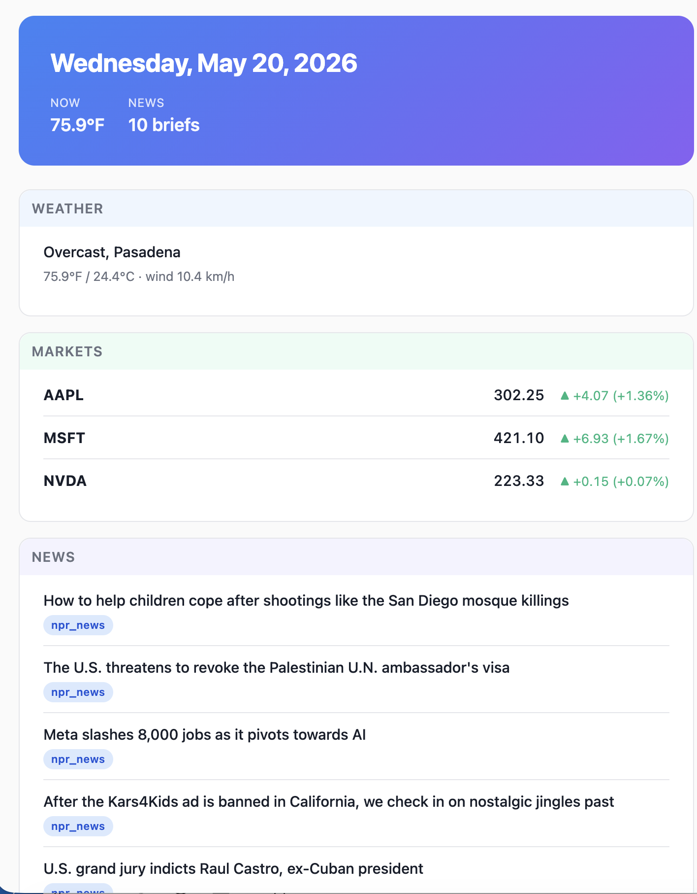
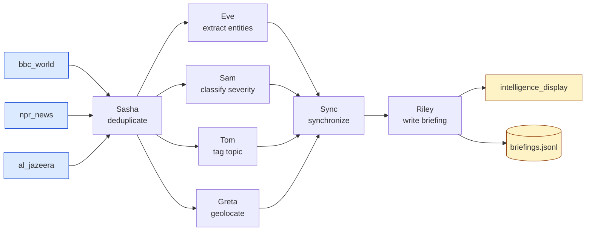

# DisSysLab

[](https://pypi.org/project/dissyslab/)
[](https://pypi.org/project/dissyslab/)
[](LICENSE)
[](https://github.com/kmchandy/DisSysLab/actions/workflows/test.yml)

**Tested skills that let an AI agent build distributed applications for you.**

You describe, in English, something you want watched and what should happen
when it changes. Your AI agent assembles it from a tested library instead of
generating the concurrency machinery from scratch. The hard parts — passing
messages between agents, knowing when the whole system has finished, saving
state so it can resume after a crash — are already written and tested.

---

## Start here

**I'm a student taking the course** → **[course/START_HERE.md](course/START_HERE.md)**
What you'll build, how to set up by talking to Cowork, and all 38 working
examples grouped by what you might care about.

**I want an agent to build me an app** → **[skills/](skills/)**
Point Cowork (or any agent that reads `SKILL.md`) at `skills/office-builder/`
and describe what you want watched.

**I want to build offices by hand** → **[docs/BUILD_APPS.md](docs/BUILD_APPS.md)**
The full grammar, the component catalogue, and worked examples.

**I'm picking this up cold** → **[docs/internals/HANDOFF_2026-08-17.md](docs/internals/HANDOFF_2026-08-17.md)**
Where things stand, what to do next, and the decisions not to relitigate.

**I want to contribute** → **[CONTRIBUTING.md](CONTRIBUTING.md)**
Install from source, run the suite, and the internals under
[docs/internals/](docs/internals/).

---

## Sixty seconds

```bash
pip install dissyslab
dsl init periodic_brief my_brief
cd my_brief && dsl run .
```

No API key, no model download. In ten to twenty seconds you get a styled HTML
brief from live news headlines, current weather, and a few stock tickers.

<p align="center">
  
</p>

`dsl list` shows every shipped office. `dsl doctor` checks your setup and runs
a small office as a self-test. Use `dsl init` rather than running a shipped
office in place — otherwise its output lands inside the installed package.

---

## What an office is

A network of agents, each with one job, running continuously. Sources fetch
from the world; agents transform the stream; sinks act on the result.


```mermaid
flowchart LR
  A[bbc_world]:::src --> D[Sasha<br/>deduplicate]
  B[npr_news]:::src --> D
  C[al_jazeera]:::src --> D
  D --> E1[Eve<br/>extract entities]
  D --> E2[Sam<br/>classify severity]
  D --> E3[Tom<br/>tag topic]
  D --> E4[Greta<br/>geolocate]
  E1 --> H[Sync<br/>synchronize]
  E2 --> H
  E3 --> H
  E4 --> H
  H --> I[Riley<br/>write briefing]
  I --> J[intelligence_display]:::sink
  I --> K[(briefings.jsonl)]:::sink
  classDef src fill:#dbeafe,stroke:#1d4ed8
  classDef sink fill:#fef3c7,stroke:#92400e
```

That diagram is generated from this — the whole program:

```
Sources: bbc_world(max_articles=3), npr_news(max_articles=3), al_jazeera(max_articles=3)
Sinks: intelligence_display, jsonl_recorder_briefing(path="briefings.jsonl")

Agents:
Sasha is a deduplicator(by="url").
Eve is an entity_extractor.
Sam is a severity_classifier.
Tom is a topic_tagger.
Greta is a geolocator.
Sync is a synchronizer(inboxes=["entities", "severity", "topic", "location"]).
Riley is a writer.

Connections:
bbc_world's destination is Sasha.
npr_news's destination is Sasha.
al_jazeera's destination is Sasha.
Sasha's out is Eve, Sam, Tom, Greta.
Eve's out is Sync's entities.
Sam's out is Sync's severity.
Tom's out is Sync's topic.
Greta's out is Sync's location.
Sync's out is Riley.
Riley's out is intelligence_display, jsonl_recorder_briefing.
```

Each agent's job is either an English description in `roles/<name>.md`, run by
a language model, or Python in `roles/<name>.py` — deterministic and free. Use
English when the job needs judgment, Python when it is exact. Networks may
contain loops; they need not be acyclic.

**Offices contain offices.** An office is a black box with inboxes and outboxes, so a complex
system is a network of sub-offices.

**Per-agent model backends.** `Eve's AI is ollama.` and `Riley's AI is claude.`
is the whole difference between a uniformly expensive system and a tiered one.
Backends: `anthropic`, `openai`, `gemini`, `openrouter`, `ollama`.

---

## Checking an office before you run it

```bash
dsl check my_office
```

Reports every structural fault at once — a declared inbox nothing writes to,
agents nothing can reach, work that reaches no sink, sinks nothing feeds, roles
with no file behind them, feedback loops with no gate.

It is a *structural* check. It cannot see faults that depend on what happens at
run time: an office whose diagram is correct can still deadlock, because
whether a message is ever readable can depend on execution history rather than
on the graph. That boundary is itself one of the ideas the course teaches.

---

## Current limitations

Named plainly, so nobody infers promises this does not keep.

- **Single machine.** An office runs in one process, each agent in its own
  thread. Per-agent process parallelism does not work; the intended unit is a
  whole office, and that is designed but not built
  ([docs/internals/process_per_office_design.md](docs/internals/process_per_office_design.md)).
  Multi-machine distribution is roadmap.
- **Checkpoint-recovery is opt-in.** The Chandy–Lamport distributed snapshot is
  implemented and [recovery_demo](dissyslab/gallery/apps/recovery_demo/)
  demonstrates it end to end. An office gets it where the author of a stateful
  agent has added `save_state` / `load_state`.
- **Deadlock detection does not exist yet.** `dsl check` finds structural
  faults only.
- **No first-party web UI.** Offices produce files — HTML, JSONL, text.
- **Platforms.** Linux and macOS supported and in CI; Windows runs and is in
  CI, with setup notes in [docs/WINDOWS.md](docs/WINDOWS.md).

---

## Why I am building this

Sense-and-respond systems have been used by large institutions for decades.
Militaries formalised them as the OODA loop. Stephan Haeckel introduced "sense
and respond" as a business methodology in 1992. In 2009 Roy Schulte and I
published *Event Processing: Designing IT Systems for Agile Companies* (Morgan
Kaufmann). I worked on two startups building such systems, and helped build
earthquake-warning and radiation-detection systems — see *Community Sense and
Response Systems: Your Phone as Quake Detector*, CACM, July 2014.

Those systems belonged to institutions because only institutions had the
expertise and the compute. Language models change that: a person can describe
an office in plain English and lean on tested machinery for the parts that are
hard to get right.

I am using this to teach distributed algorithms to undergraduates, including
first-year students. Each student builds a system for something they actually
care about, and then we study the algorithms holding it up — termination
detection, global snapshots, consensus. For the formal treatment behind the
course, see *Parallel Program Design: A Foundation*, K. Mani Chandy and Jayadev
Misra (Addison-Wesley, 1988).

---

## Repository map

| Path | What's in it |
|---|---|
| [course/](course/) | The course: start here, setup, the catalogue |
| [skills/](skills/) | Skills an agent loads to build offices |
| [docs/](docs/) | Reference — grammar, components, backends, internals |
| [dissyslab/](dissyslab/) | The library (the `dissyslab` PyPI package) and the gallery |
| [tests/](tests/) | The suite; CI runs it on Python 3.10–3.14 |
| `dev/` | Maintainer notes and scratch work |

---

## Install from source

```bash
git clone https://github.com/kmchandy/DisSysLab.git
cd DisSysLab
python3 -m venv .venv && source .venv/bin/activate
pip install -e ".[dev]"
dsl doctor && pytest tests/ -q
```

Note the `[dev]`. A plain `pip install -e .` runs offices but omits the test
tools. Python 3.10 or newer.

For offices with LLM agents, pick a backend and export its credentials — see
[docs/API_KEY_SETUP.md](docs/API_KEY_SETUP.md) and
[docs/LANGUAGE_MODELS.md](docs/LANGUAGE_MODELS.md). Every shipped office stops
after a few cycles by default, so you will not run up a bill by accident.

---

## License

MIT — see [LICENSE](LICENSE).
