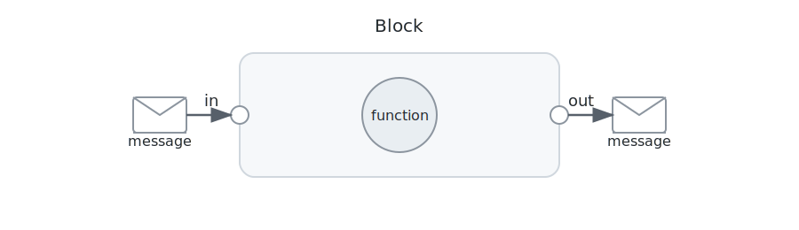

# 🕸️ DisSysLab: Agents Collaborate by Exchanging Messages

**DisSysLab** is a lightweight Python framework for building applications in which **multiple agents collaborate by exchanging messages**. It is designed for:

- 🧑‍🎓 **Non-programmers**: Build distributed applications by connecting pre-built components from sources such as OpenAI, Microsoft Copilot, NumPy, and Scikit-learn.  
- 🧑‍💻 **Programmers**: Build distributed applications in Python by connecting blocks. Use a block like any other Python class. Connect blocks to form larger blocks or embed blocks in programs.

---

## 🔧 Core Idea 1: Build Applications by Connecting Blocks

A **block** is an object with:

- Input and/or output ports  
- A `run()` function  

A **network** consists of blocks and connections. For example, here is a network consisting of three blocks: generator, transformer, and recorder. The generator outputs messages that are received by the transformer. Messages output by the transformer are received by the recorder.

Blocks may have multiple inputs and outputs.

---

## 🔧 Core Idea 2: A Block Embodies a Function

A block is a shell that calls **functions** (or prompts) to generate, transform, or record messages. For example:

- A **generator** block may use an OpenAI connector to output financial news about specified companies.  
- A **transformer** block may use an LLM agent to output the positive or negative sentiment of the messages it receives.  
- A **recorder** block may use a Microsoft Copilot connector to put results into an Excel spreadsheet.

 

**You build a distributed application by specifying and connecting blocks.**

---

## 🧩 Blocks Are Composable

- **Parallel Composition**: Use a network as a block inside a larger network.  
- **Sequential Composition**: Call blocks from regular Python code just as you would call any function.

---

## 🚦 This Website

A quick way to get an idea of this framework is to read the README.md file in each of the following chapters; run programs in the file, and modify the programs.

- **Build a network by specifying and connecting blocks.** [Chapter 1](dsl/examples/ch01_networks/README.md)
- **Messages.** [Chapter 2](dsl/examples/ch02_keys/README.md)
- **Network Structures.** [Chapter 3](dsl/examples/ch03_fanin_fanout/README.md)
- **GPT blocks.** [Chapter 4](dsl/examples/ch04_GPT/README.md)
- **Data Science Blocks** [Chapter 5](dsl/examples/ch05_ds/README.md)
- **Connectors to External Applications** [Chapter 6](dsl/examples/ch06_git/README.md)

### 🔍 Coming Later
🖼️ A drag-and-drop UI for visual network construction

### 🤝 Collaborate
📬 We want to make distributed systems understandable — and enjoyable — for everyone.
DisSysLab is an educational project. Collaboration is welcome. We plan to have a stable framework by mid-October.