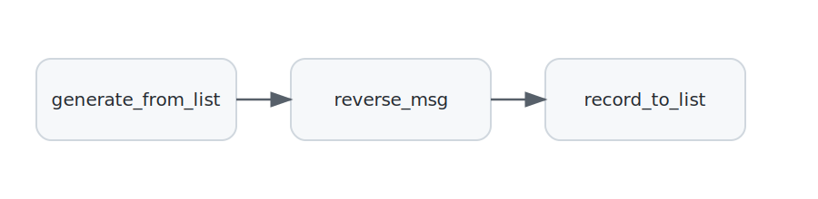

# 🧩 Chapter 01—Networks

## Key Idea:  Network = Blocks + Connections

Many distributed applications, such as those that control industrial processes, run forever.
Some distributed applications are designed to terminate after processing limited amounts of data. Multiple concurrent threads of execution can result in faster execution than sequential programs. 

We begin with simple examples that terminate. Later we develop applications that continue to acquire and process data.


## 🎯 Goal
Learn how to build a distributed application by creating **blocks** and connecting them to form a **network**.

See an example of the two core ideas:

- ***A distributed system consists of connected blocks.***
- ***A block embodies a function that processes a stream of messages.***

---

## 📍 What We’ll Build

We’ll create a **three-block network**:

1. **Source** – generate a stream of messages.
2. **Transform** – receive a message stream and output a transformation of the stream.
3. **Sink** – store or display a message stream. 

**Visual:** `[ Source ] → [ Transform ] → [ Sink ]`

---

## ⚙️ How It Works

- **🔲 Blocks**  
  - A block has some number of input and output ports called inports and outports, respectively
  - A block executes a function that receives messages from its inports and sends messages through its outports.

- **🔗 Connections**  
  - A connection connects a block’s **output port** to a block’s **input port**. 

**📊 Diagram of blocks and connections of this example:**



**Blocks in this example:**
- block name: ***"source"***, execution: ***FromList["hello", "world"]*** – Generate a stream consisting of message "abc" followed by message "def". The stream is sent on an outport "out".
- block name: ***"transform"***, execution: ***Uppercase*** – Receives a stream of messages on inport "in" and sends the uppercase of the messages that it receives on outport "out".
- block name: ***"sink"***, execution ***ToList*** – Receives a stream of messages on inport "in" and stores the stream that it receives in a list.

(Block types with multiple inports and outports are introduced later.)


---

## 💻 Code Example
 
```
def basic_network():
    results = []  # Holds results sent to sink

    net = Network(
        blocks={
            "source": FromList(['hello', 'world']),
            "transform": Uppercase(),
            "sink": ToList(results),
        },
        connections=[
            ("source", "out", "transform", "in"),
            ("transform", "out", "sink", "in"),
        ],
    )

    net.compile_and_run()
    assert results == ['HELLO', 'WORLD']
```

### ▶️ Run It
```
python3 -m dsl.examples.ch01_networks.simple_network

['cba', 'fed']
```


## 🧠 Key Takeaways

- **network = blocks + connections**  
- **blocks**: each block executes a function that *processes messages*
- **connections**:  specify how *messages flow* from block to block.

---

### 🚀 Coming Up

Would you like to create a network that receives movie reviews, gives each movie a score by analyzing its review, and outputs both the review and its score?

👉 [**Next up: Chapter 2. Messages as Dictionaries.**](../ch02_keys/README.md)
