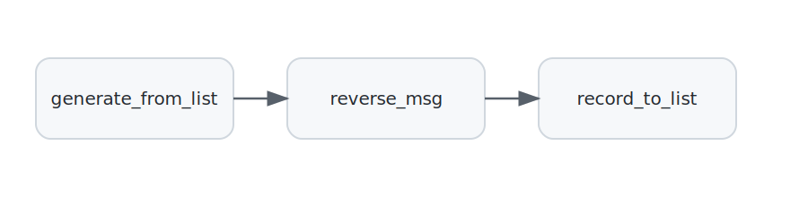

# 🧩 Chapter 1 — Networks = Blocks + Connections

### 🎯 Goal
Learn how to build a distributed application by creating **blocks** and connecting them to form a **network**.

See the core ideas in an example:

- A distributed system consists of connected blocks.
- A block embodies a function.

---

## 📍 What We’ll Build

We’ll create a **three-block network**:

1. **Generator** – produces a list of short text strings.  
2. **Transformer** – applies a function to each string (in this case, reversing the text).  
3. **Recorder** – saves the results in a Python list.

**Visual:** `[ Generator ] → [ Transformer ] → [ Recorder ]`

---

## ⚙️ How It Works

- **🔲 Blocks**  
  - A block has some number of input and output ports called inports and outports, respectively
  - A block executes a function that receives messages from its inports and sends messages through its outports.

- **🔗 Connections**  
  - A connection connects a block’s **output port** to a block’s **input port**. 

**Block types in this example:**
- **Generator** – single outport, no inports.  
- **Transformer** – single inport, single outport.  
- **Recorder** – single inport, no outports.

(Block types with multiple inports and outports are introduced later.)


---

## 💻 Code Example

**📊 Diagram of blocks and connections:**

 

 
```python
# dsl/examples/ch01_networks/simple_network.py

from dsl.core import Network
from dsl.block_lib.stream_generators import GenerateFromList
from dsl.block_lib.stream_transformers import TransformerFunction
from dsl.block_lib.stream_recorders import RecordToList

# Transformation function: reverse a string
def reverse_text(x):
    return x[::-1]

# Where we’ll store results
results = []

# Define the network
net = Network(
    blocks={
        "generate_from_list": GenerateFromList(items=["abc", "def"]),
        "reverse_msg": TransformerFunction(func=reverse_text),
        "record_to_list": RecordToList(results),
    },
    connections=[
        ("generate_from_list", "out", "reverse_msg", "in"),
        ("reverse_msg", "out", "record_to_list", "in"),
    ]
)
# Run the network
net.compile_and_run()
```

### ▶️ Run It
```bash
python3 -m dsl.examples.ch01_networks.simple_network

['cba', 'fed']
```


## 🧠 Key Takeaways

- **network = blocks + connections**  
- **blocks** define functions that *process messages*
- **connections** define the *flow of messages*.

---

### 🚀 Coming Up

How would you create a block that receives movie reviews, gives each movie a score by analyzing its review, and outputs both the review and its score?

👉 [**Next up: Chapter 2. Messages as Dictionaries.**](../ch02_keys/README.md)
