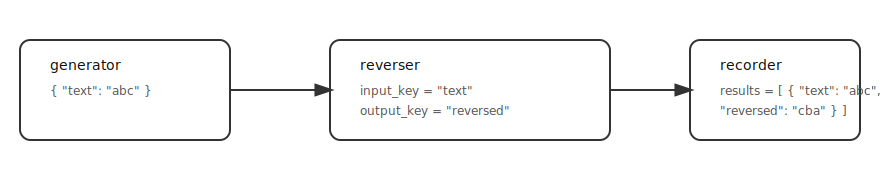

# 🧩 Chapter 2 — Messages as Dictionaries

### 🎯 Goal
Learn how **messages as dictionaries** (key–value pairs) help to attach extra information (like `source` or `time` or `sentiment_score`) to every message.

---

## 📍 What We’ll Build

We’ll create a **three-block network**, just as in Chapter 1, except that now messages are dictionaries.

- **Generator** – produces dicts with a `"text"` field.  
- **Transformer** – reads `msg["text"]`, writes result into `msg["reversed"]`.  
- **Recorder** – stores the full dictionary messages. 

**Visual:**  
`[ Generator ] → [ Transformer ] → [ Recorder ]`

---


## 💻 Code Example

**📊 Diagram of blocks and connections:**  


```python
# dsl/examples/ch02_keys/message_network.py

from dsl.core import Network
from dsl.block_lib.stream_generators import GenerateFromList
from dsl.block_lib.stream_transformers import TransformerFunction
from dsl.block_lib.stream_recorders import RecordToList

# Transformation function: reverse a string
def reverse_text(x):
    return x[::-1]

results = []

net = Network(
    blocks={
        # Generator emits dicts: {"text": "abc"}, {"text": "def"}
        "generator": GenerateFromList(
            items=["abc", "def"],
            key="text"
        ),
        # Transformer reads msg["text"], writes msg["reversed"]
        "reverser": TransformerFunction(
            func=reverse_text,
            input_key="text",
            output_key="reversed",
        ),
        # Recorder saves the resulting dictionaries
        "recorder": RecordToList(results),
    },
    connections=[
        ("generator", "out", "reverser", "in"),
        ("reverser", "out", "recorder", "in"),
    ]
)

net.compile_and_run()
print(results)

**Diagram**

```

## ▶️ Run It
```
python3 -m dsl.examples.ch02_messages.message_network
```

## ✅ Output
```
[
    {"text": "abc", "reversed": "cba"},
    {"text": "def", "reversed": "fed"}
]
```

## 🧠 Key Takeaways

- Messages can be dictionaries.

- Transformers can specify:

   - input_key → which field of a message to read.

- output_key → the field of the message in which the result is stored.

Blocks can add fields such as "source", "time", and "sentiment_value" to a message.
