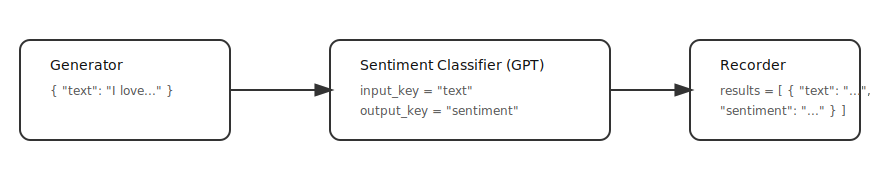

# 🧩 Chapter 2 — Input & Output Keys

In Chapter 1, a message is an arbitrary object. In this chapter, messages are **dictionaries** (e.g., `{"text": "...", "sentiment": ...}`) and generators, transformers, and recorders operate on data specified by **keys** of the dictionary:

- `input_key`: the field of the incoming message that is read by a transformer or recorder.
- `output_key`: the field of the output message that is written by a transformer or generator.

How keys help:
- You can **preserve the original message** while adding new fields (e.g., keep `"text"` and add `"sentiment"`).

In later chapters we describe ways in which you can use messages of arbitrary classes in addition to dicts.

---

## 🔧 Example: generate text ➜ classify sentiment ➜ record text & sentiment

**Diagram**

