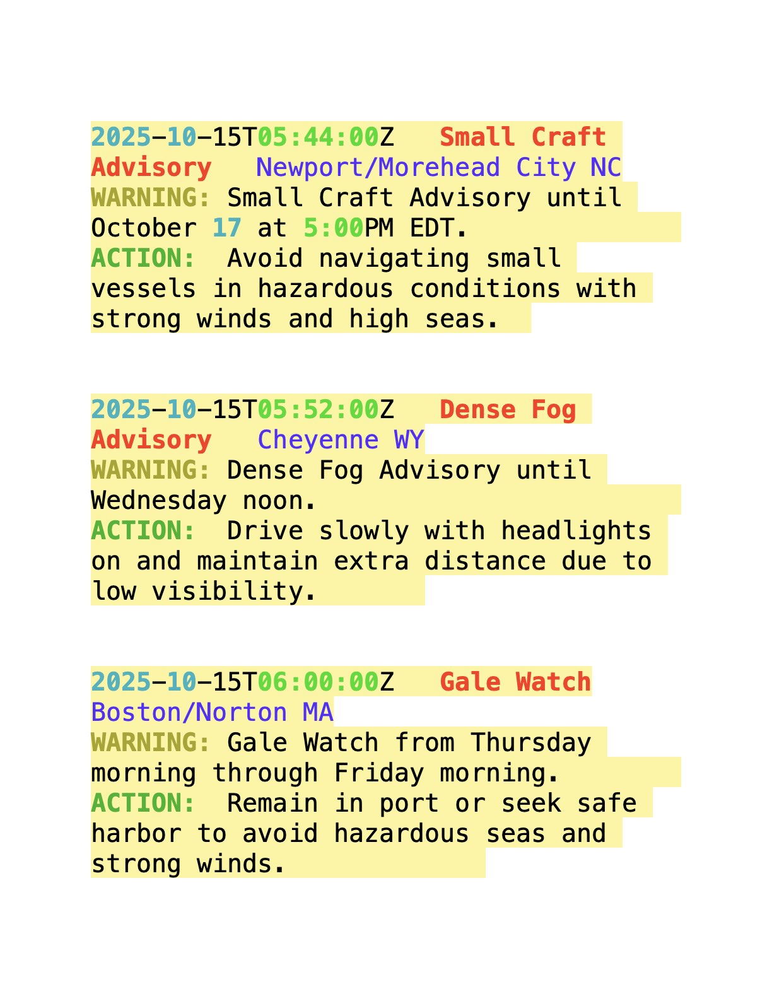

# 5 • Weather Alerts — RSS + OpenAI Extraction

> **Important notes**
> 1) **Do not use the weather alerts feed casually.** This is an operational feed intended for real, potentially life-threatening alerts. Use it respectfully and only for learning/testing as needed.  
> 2) **The weather alerts feed can be slow to respond.** You may need to wait several minutes before seeing output.

This page shows how to connect to the **NWS Weather Alerts (Atom/RSS) feed** and run an **OpenAI transformer** to extract a compact, safety-focused summary from each alert.

---

## What you’ll do
Run a script that polls the official NWS active alerts feed, extracts a small dict per alert (`title`, `page_text`), and sends it to an OpenAI agent that returns a minimal JSON summary (`alert_type`, `location`, `issued_time`, `headline`, `short_advice`). The output is streamed to a live console sink.

---

## Setup (once)
```bash
pip install requests beautifulsoup4 lxml openai rich
```

Set your OpenAI API key (choose one):

**macOS / Linux**
```bash
export OPENAI_API_KEY="sk-…your key…"
```

**Windows (PowerShell)**
```powershell
$env:OPENAI_API_KEY="sk-…your key…"
```

> _Notes:_  
> • `lxml` enables reliable XML parsing for Atom/RSS feeds.  
> • The example uses `dsl.extensions.agent_openai.AgentOpenAI`, which expects your key in `OPENAI_API_KEY`.

---

## The Weather Alerts Demo

```python
# examples.rss_alerts_demo

import time
from dsl.connectors.rss_in import RSS_In
from dsl import network
from dsl.extensions.agent_openai import AgentOpenAI
from dsl.extensions.add_fields import add_fields
from .live_alert_console import live_alert_sink

# Define functions.
rss = RSS_In(
    url="https://api.weather.gov/alerts/active.atom/",
    fetch_page=True,
    poll_seconds=4,
    life_time=20,
)

def from_rss():
    news_items = rss.run()
    for news_item in news_items:
        print(f"news_item = {news_item}")
        yield {k: news_item.get(k) for k in ("title", "page_text")}

system_prompt = '''You are a weather-alert extraction agent. 
Your job is to analyze an alert which is a dict {'title': title, 'page_text': 'page_text} where title is a short
string and page_text is a long string.
Your job is to extract information from the alert and return a JSON object 
with exactly the following keys:

"alert_type" — the official alert name (e.g., Small Craft Advisory, Flood Watch).

"location" — the human-readable city and state/territory code (e.g., Anchorage AK, Melbourne FL). 
Prefer the phrase after “by NWS …” in the title (e.g., “by NWS Anchorage AK” → Anchorage AK). If that isn’t present, use the clearest city+state mentioned in the alert text. If truly unknown, use null.

"issued_time" — the alert issuance time in UTC ISO-8601 (YYYY-MM-DDThh:mm:ssZ).

If not explicitly provided, use the most plausible end/expiration time implied by the alert; if truly unknown, use null.

"headline" — a short, natural-language headline summarizing the alert and timeframe (e.g., Small Craft Advisory until Saturday evening). Keep it under ~80 characters.

"short_advice" — one concise, practical safety tip tailored to the alert (less than 40 words, imperative mood, no exclamation marks).

Output requirements:

Return exactly one JSON object with only these five keys, in this order.

All values must be strings, except you may use null for unknown times or location.

Normalize all times to UTC with a Z suffix. Convert from offsets in the input (e.g., …-08:00 → add 8 hours).

Do not include explanations, reasoning, markdown, or extra fields.

Extraction guidance (apply in this priority):

alert_type: take the segment before “issued …” in the title; if absent, use the named event in the text (e.g., NWSheadline, event).

location: prefer the substring after by NWS at the end of the title (e.g., by NWS Anchorage AK → Anchorage AK). If multiple places are listed, pick the primary office/city associated with the NWS office. If only county/zone codes are present, choose the principal city referenced; otherwise null.

Times:

Parse all RFC 822/ISO-8601 timestamps in the title/text.

Issued: the timestamp closest to the word “issued” in the title; if not present, the earliest timestamp in the text.

headline: <Alert Type> … + concise timeframe (e.g., “until Saturday evening”, “through Sunday morning”).

short_advice: write one or two actionable sentences appropriate to the hazard (e.g., marine → “Delay small-vessel trips and check latest marine forecast.”; flood → “Avoid flooded roads; monitor updates and be ready to seek higher ground.”).

Return format example (illustrative only):
{
"alert_type": "Small Craft Advisory",
"location": "Anchorage AK",
"issued_time": "2025-10-03T11:31:00Z",
"headline": "Small Craft Advisory until Saturday evening",
"short_advice": "Delay small-vessel trips and check the latest marine forecast before departing."
}
Output rules:
- Return ONLY valid RFC8259 JSON. No markdown, no code fences, no comments, no extra text.
- Use double quotes for all keys and strings.
- No trailing commas.
- If none found, use [] (empty array).
- Begin the response with "{" and end with "}".
'''
agent = AgentOpenAI(system_prompt=system_prompt)

def print_sink(v):
    print(v)

# Define the network
g = network([(from_rss, agent.fn), (agent.fn, live_alert_sink)])
g.run_network()
```

---

## Run the demo
```bash
python3 -m examples.rss_alerts_demo
```

You should see alert summaries printed in the live console (after a possible delay).  




---

## Parameters you can modify

| Parameter | Type | Description |
|-----------|------|-------------|
| **url** | str | The Atom/RSS feed URL (defaults to active NWS alerts). |
| **fetch_page** | bool | If `True`, fetch and parse the linked alert page for richer `page_text`. |
| **poll_seconds** | float | How often to repoll for new alerts. Increase to be kinder to servers. |
| **life_time** | float \| None | Max wall-clock duration before auto-stop (`None` → run indefinitely). |
| **system_prompt** | str | Controls the exact extraction schema and normalization rules. |
| **live_alert_sink** | sink | Console sink for live, readable output (replace with a file/JSONL sink if desired). |

> _Tip:_ If your `rss_in` supports XML parsing options, prefer an **XML parser** (e.g., `lxml-xml`) for Atom/RSS feeds to avoid HTML-as-XML warnings.

---

## Troubleshooting

- **Long delay / no output:** The active alerts feed can be slow and may have lulls; wait several minutes. You can also extend `life_time`.  
- **XMLParsedAsHTMLWarning:** Install `lxml` and parse feeds as XML (`"lxml-xml"`); keep `"html.parser"` for fetched article pages only.  
- **Rate limiting / HTTP errors:** Increase `poll_seconds`, check connectivity, and avoid aggressive polling.  
- **Unexpected model output:** Tighten the `system_prompt` to require **strict JSON** with exactly the five keys, no extra text.  
- **Time normalization:** If UTC conversion seems off, explicitly instruct the model to normalize to `Z` and double-check the source timestamps.

---

## Next steps
- Swap the sink for a **JSONL/CSV recorder** (Module 5) to log alerts for later analysis.  
- Add a transform to **filter by alert type or location** (e.g., marine only, a specific state).  
- Combine with other sources (Module 2) to build a **situational awareness dashboard**.  
- Extend the prompt to extract **severity**, **areas**, or **expiration** when present.

